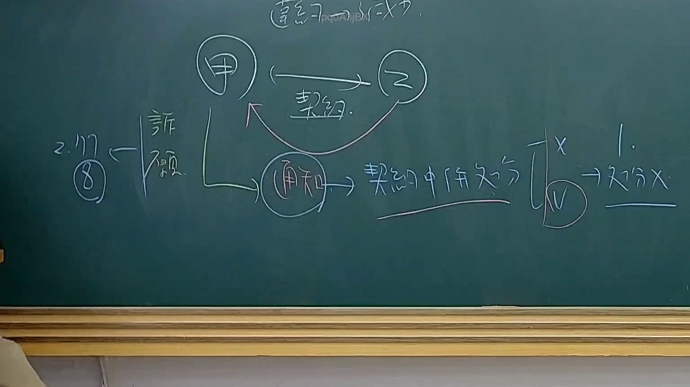

# 🎥 影音教材板書校對筆記
    - **來源影片**: [預約 34 2025-08-07 08-14-49-946](file:///J:/行政法A/ch34/預約 34 2025-08-07 08-14-49-946.mp4)
    - **課程分類**: `[行政法A`
    - **課堂章節**: `ch34]`
    - **影片時間戳記**: `01:28:45` (5325 秒)
    - **板書類型**: `影音板書`
    - **偵測時間**: 2026-07-22 03:19:25
    
    ## 🔍 擷取黑板板書對照圖
    
    
    ## 🧠 AI 智慧理解與知識庫演化註記
    ：
1. 【板書高精度 OCR】：
   - 頂部：契約一部分不成立
   - 主體關係：甲、乙之間存有「契約」關係。
   - 下方衍生程序與爭點：
     - 甲發出「通知」，指向「契約中部分有效」或「契約部分無效」之法律效果探討。
     - 區分說／見解：有打叉（X）與打勾（V）之對立見解。
     - 右側註記：1. ➔ 不分X
     - 左側註記：2. (8) ➔ 詐顯（詐欺或顯失公平）

2. 【板書詳細解讀與法條對照】：
   - **法律學理與爭點**：本板書探討的是當契約之一部分無效或不成立時，其法律效果究竟是「全部無效」（民法第111條前段）抑或「原則上部分有效、例外全部無效」（民法第111條但書），或者是契約一部不成立時的法律適用問題。
   - **民法條文對照**：
     - **民法第 111 條（法律行為之一部無效）**：「法律行為之一部無效者，全部皆為無效。但除去該部分亦可達其目的者，則其餘部分，仍為有效。」
     - 同時涉及意思表示不自由、撤銷權（如民法第92條詐欺）或顯失公平（民法第74條）之法律效果比較與體系架構。
    
    ## 📊 可編輯之 Mermaid 關係流程圖
    ```mermaid
    ：
graph TD
    A["甲"] -->|契約| B["乙"]
    A -->|"通知"| C["契約中部分有效"]
    C --> D["見解1 不分X"]
    C --> E["見解2 區分說(V)"]
    F["2.(8)"] -->|"詐顯"| A
    ```
    
    ## ✍️ 操作者手動校對修改區
    <!-- 您可以直接修改上方的文字或調整 Mermaid 區塊中的節點，Obsidian 會即時重新渲染 -->
    - [ ] 欄位結構與法律邏輯已校對無誤。
    - **校對筆記**: 
    