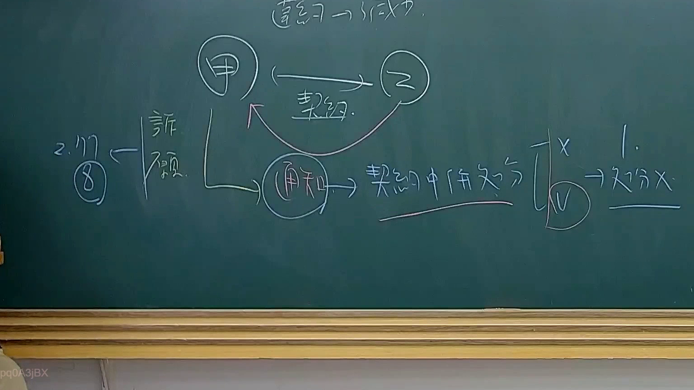

# 🎥 影音教材板書校對筆記
    - **來源影片**: [預約 34 2025-08-07 08-14-49-946](file:///J:/行政法A/ch34/預約 34 2025-08-07 08-14-49-946.mp4)
    - **課程分類**: `[行政法A`
    - **課堂章節**: `ch34]`
    - **影片時間戳記**: `01:31:00` (5460 秒)
    - **板書類型**: `影音板書`
    - **偵測時間**: 2026-07-22 03:19:35
    
    ## 🔍 擷取黑板板書對照圖
    
    
    ## 🧠 AI 智慧理解與知識庫演化註記
    ：
1. 板書文字與符號高精度辨識：
   - 頂部：締結 -> 不成立
   - 主體關係：甲 與 乙 之間有「契約」關係。
   - 甲向下延伸：經「通知」指向「契約關係之分（或效力）」，並附有「X」與「V」的對比（V被圈起），右側指向「1. 效力X（或無效）」。
   - 左側分支：由甲或相關主體指向「詐願」，再向左指向「2. 177條第8項」（或民法相關條文、意思表示錯誤/詐欺撤銷等學理爭點）。

2. 法律學理與法條對照：
   - 本板書探討的是契約之締結與其效力、意思表示瑕疵（如詐欺、錯誤）或無權代理／無權處分等法律關係中的通知義務與法律效果。
   - 涉及臺灣現行《民法》相關規定，例如意思表示不自由（詐欺、脅迫，民法第92條）或契約不成立、無效之法律效果，以及無因管理（民法第177條）等規範在實務操作中的檢討與區辨。
    
    ## 📊 可編輯之 Mermaid 關係流程圖
    ```mermaid
    ：
graph TD
    A["甲"] -->|"契約"| B["乙"]
    A -->|"通知"| C["契約中併效分"]
    C --> D["X"]
    C --> E["V"]
    E --> F["1. 效力X"]
    A -->|"詐願"| G["2. 177條"]
    ```
    
    ## ✍️ 操作者手動校對修改區
    <!-- 您可以直接修改上方的文字或調整 Mermaid 區塊中的節點，Obsidian 會即時重新渲染 -->
    - [ ] 欄位結構與法律邏輯已校對無誤。
    - **校對筆記**: 
    