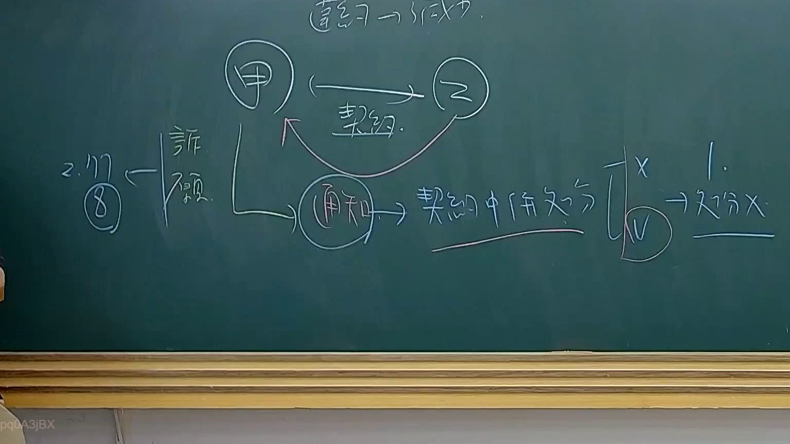

# 🎥 影音教材板書校對筆記
    - **來源影片**: [預約 34 2025-08-07 08-14-49-946](file:///J:/行政法A/ch34/預約 34 2025-08-07 08-14-49-946.mp4)
    - **課程分類**: `[行政法A`
    - **課堂章節**: `ch34]`
    - **影片時間戳記**: `01:31:30` (5490 秒)
    - **板書類型**: `影音板書`
    - **偵測時間**: 2026-07-22 03:20:06
    
    ## 🔍 擷取黑板板書對照圖
    
    
    ## 🧠 AI 智慧理解與知識庫演化註記
    ：
1. **板書文字辨識 (OCR)**：
   - 頂部：違約 -> 成立。
   - 中間關係：甲（左圓圈）、乙（右圓圈），兩者間有「契約」關係。
   - 下方流程：甲引發一個「通知」（圓圈），指向「契約中併存處分」。
   - 右側邏輯：
     - 「1. -> 處分 X」（代表不具備行政處分性質）。
     - 垂直線區隔「X」與「V」（圓圈）。
   - 左側邏輯：
     - 「2. 117 ⑧」與「訴願」（代表若具備處分性質，則進入訴願程序）。

2. **法律學理與爭點分析**：
   - **核心課題**：行政契約與行政處分之併存問題（行政契約關係中，機關行為之性質辨識）。
   - **法律關係邏輯**：當行政機關（甲）與人民（乙）訂立行政契約（依行政程序法第135條）後，若乙發生「違約」情事，甲發出的「通知」在法律救濟上會產生分歧：
     - **路徑 1（私法行為/契約履行）**：若該通知僅是基於契約對等地位所為之權利主張（如民法上的催告、終止意思表示），則「處分 X」，意即它不是行政處分。人民若有不服，應提起行政訴訟中的「給付訴訟」或「確認訴訟」。
     - **路徑 2（高權行為/併存處分）**：若法規授權機關在契約履行過程中，仍得行使公權力作成裁決（例如政府採購法第101條之停權通知），則該通知被視為「行政處分」。
   - **法條對照與註記**：
     - **行政程序法第 149 條**：行政契約準用民法規定，故有「違約」與「通知」之概念。
     - **行政程序法第 117 條**：板書中標註的「117 ⑧」，應指行政機關對其違法處分之撤銷權，或是在討論契約中併存處分若違法時，是否適用第117條之職權撤銷。
     - **訴願法**：一旦認定為「處分 V」，依據訴願法第1條，當事人必須先提起「訴願」，不可直接起訴。
    
    ## 📊 可編輯之 Mermaid 關係流程圖
    ```mermaid
    ：
graph TD
    A["甲 (行政機關)"] -- "訂立行政契約" --> B["乙 (人民)"]
    B -- "發生違約事實" --> A
    A -- "發出 (通知)" --> C{"性質辨識"}
    C -- "1. 契約履行行為" --> D["非行政處分 (處分 X)"]
    C -- "2. 高權行為 (併存處分)" --> E["行政處分 (處分 V)"]
    E -- "救濟路徑" --> F["提起訴願"]
    F -- "相關法條" --> G["行政程序法 117 條"]
    D -- "救濟路徑" --> H["行政訴訟 (給付/確認)"]
    style C fill#f9f,stroke#333,stroke-width2px
    style E fill#ccf,stroke#333,stroke-width2px
    ```
    
    ## ✍️ 操作者手動校對修改區
    <!-- 您可以直接修改上方的文字或調整 Mermaid 區塊中的節點，Obsidian 會即時重新渲染 -->
    - [ ] 欄位結構與法律邏輯已校對無誤。
    - **校對筆記**: 
    