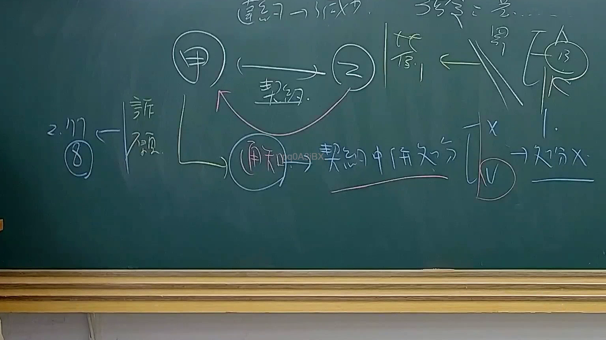

# 🎥 影音教材板書校對筆記
    - **來源影片**: [預約 34 2025-08-07 08-14-49-946](file:///J:/行政法A/ch34/預約 34 2025-08-07 08-14-49-946.mp4)
    - **課程分類**: `[行政法A`
    - **課堂章節**: `ch34]`
    - **影片時間戳記**: `01:35:00` (5700 秒)
    - **板書類型**: `影音板書`
    - **偵測時間**: 2026-07-22 03:20:38
    
    ## 🔍 擷取黑板板書對照圖
    
    
    ## 🧠 AI 智慧理解與知識庫演化註記
    ：
本板書核心在於辨析「行政契約」中之「通知行為」性質，以及其與「行政處分」之區別，並探討救濟路徑。

1. 板書文字辨識 (OCR)：
   - 角色：甲、乙、丙（丙處標註13，可能代表第三人或相關條文）。
   - 行為/關係：契約（甲乙之間）、通知、契約關係部分。
   - 法律概念：處分 X（代表非行政處分）、訴願、2. 117（指行政程序法第117條）、⑧（序號或特定要件）。
   - 其他：違約→成立。

2. 法律學理與爭點解讀：
   - 契約與通知之性質：圖中甲與乙存在「契約」關係（通常指行政契約）。當甲對乙發出「通知」時，該通知被界定為「契約關係部分」的法律行為，而非單方高權的「行政處分」（標註為處分 X）。
   - 處分性之辨析：在行政契約履行過程中，行政機關所為之意思表示（如終止契約、催告、違約扣款通知），實務上常依「雙階理論」或「契約行為從屬性」判斷。若該通知僅係基於契約當事人地位所為之主張，則不具行政處分性，不得提起訴願。
   - 救濟路徑（訴願與117條）：左側提及「訴願」並連結到「2. 117」，這反映了若行為被認定為行政處分，才適用行政程序法第117條（違法行政處分之撤銷）及訴願法救濟。若為契約爭議，則應依行政訴訟法第8條提起「給付訴訟」或依第4條提起「確認契約關係存在/不存在之訴」。
   - 丙的介入：右上方的丙與乙之間有斜線劃掉，可能代表契約行為不直接及於第三人，或行政行為對第三人之效力排除。

3. 臺灣法條對照：
   - 行政程序法第135條：行政契約之容許性。
   - 行政程序法第149條：行政契約準用民法相關規定。
   - 行政程序法第117條：違法行政處分之撤銷（板書直接標註117）。
   - 訴願法第1條：針對行政處分之救濟前提。
   - 行政訴訟法第8條：給付訴訟（針對行政契約爭議之主要救濟手段）。
    
    ## 📊 可編輯之 Mermaid 關係流程圖
    ```mermaid
    ：
graph TD
    A["甲 (行政機關)"] -- "締結契約" --- B["乙 (人民/廠商)"]
    A --> C["發出通知"]
    C --> B
    C -- "法律性質判斷" --> D{"是否為處分?"}
    D -- "否 (處分 X)" --> E["契約關係部分"]
    D -- "是" --> F["行政處分"]
    E -- "救濟路徑" --> G["行政訴訟 (給付/確認)"]
    F -- "救濟路徑" --> H["訴願 / 行程法 §117"]
    I["丙 (第三人)"] -- "效力排除" -.- B
    J["違約"] --> K["契約責任成立"]
    H --> L["⑧ 撤銷行為"]
    L --> M["2. 117條應用"]
    ```
    
    ## ✍️ 操作者手動校對修改區
    <!-- 您可以直接修改上方的文字或調整 Mermaid 區塊中的節點，Obsidian 會即時重新渲染 -->
    - [ ] 欄位結構與法律邏輯已校對無誤。
    - **校對筆記**: 
    