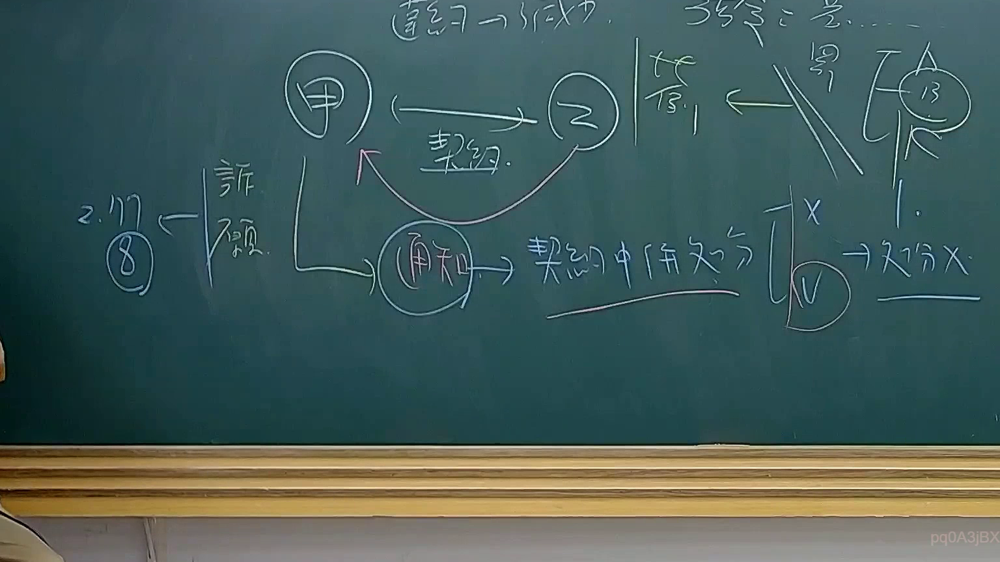

# 🎥 影音教材板書校對筆記
    - **來源影片**: [預約 34 2025-08-07 08-14-49-946](file:///J:/行政法A/ch34/預約 34 2025-08-07 08-14-49-946.mp4)
    - **課程分類**: `[行政法A`
    - **課堂章節**: `ch34]`
    - **影片時間戳記**: `01:36:00` (5760 秒)
    - **板書類型**: `影音板書`
    - **偵測時間**: 2026-07-22 03:20:57
    
    ## 🔍 擷取黑板板書對照圖
    
    
    ## 🧠 AI 智慧理解與知識庫演化註記
    ：

1. **板書高精度 OCR 內容辨識**：
   - 頂部文字：`違約 —> 扣除`、`補發 = 差...`
   - 中央核心關係：`(甲)` 與 `(乙)` 之間以雙向箭頭連結，下方標註 `契約`。
   - 右側關係：`答`（抗辯）與 `罰`（罰則/違約金），箭頭指向 `(13)`（可能指代條文或特定案號）。
   - 下方流程：`(甲)` 指向 `(通知)`，隨後連接到 `契約中併處分`。
   - 爭點標記：在 `契約中併處分` 後方有一個方括弧，上方標記 `X`，下方標記圓圈內的 `V`。最後結論處寫著 `—> 處分 X` 並加上底線，表示「非行政處分」。
   - 左側救濟路徑：`訴願` 指向 `2. 107 (8)`（辨識推論為：107年8月庭長法官聯席會議決議）。

2. **法律學理與爭點解說**：
   - **核心爭點**：行政機關（甲）與私人（乙）訂立契約後，在履行契約過程中，機關所為之「通知」或「扣款」行為，其法律性質為何？是屬於「私法上的權利主張」還是「公法上的行政處分」？
   - **契約中併處分之否定**：板書中老師強調「處分 X」，這代表在行政契約或採購契約履行階段，機關行使契約權利（如通知扣罰違約金、解除契約）時，原則上被視為與一般當事人地位平等的私法行為（或契約行為），而非單方高權的行政處分。
   - **實務見解對照**：
     - **最高行政法院 107 年 8 月份庭長法官聯席會議**：該決議針對行政契約的履行爭議，認為行政機關單方終止契約或行使契約權利，並非行政處分，故不得提起訴願及撤銷訴訟。
     - **政府採購法相關**：若是涉及《政府採購法》第 101 條的通知（黑名單），則屬「行政處分」；但若是涉及保證金扣抵或違約金請求，則屬於契約爭議，應循民事訴訟或仲裁途徑。
   - **邏輯結構**：甲乙之間有契約關係 -> 乙違約 -> 甲發出通知 -> 該通知並非行政處分（處分 X） -> 若要救濟，則不走「訴願」路徑（故訴願旁有標註，用以對比正確的私法救濟）。
    
    ## 📊 可編輯之 Mermaid 關係流程圖
    ```mermaid
    ：
graph TD
    A["甲 (行政機關)"] -- "雙務契約" --- B["乙 (私人/廠商)"]
    B -- "違約行為" --> C["甲發出 (通知/扣款)"]
    C --> D{"法律性質爭點"}
    D -- "契約中併處分?" --> E["是 (V)"]
    D -- "非行政處分 (X)" --> F["結論：處分 X (私法行為)"]
    E --> G["救濟：訴願 / 行政訴訟"]
    F --> H["救濟：民事訴訟 / 仲裁"]
    I["參考見解：107年8月決議"] -.-> F
    J["違約金/扣罰"] -- "答 (抗辯)" --> K["契約關係履行"]
    ```
    
    ## ✍️ 操作者手動校對修改區
    <!-- 您可以直接修改上方的文字或調整 Mermaid 區塊中的節點，Obsidian 會即時重新渲染 -->
    - [ ] 欄位結構與法律邏輯已校對無誤。
    - **校對筆記**: 
    