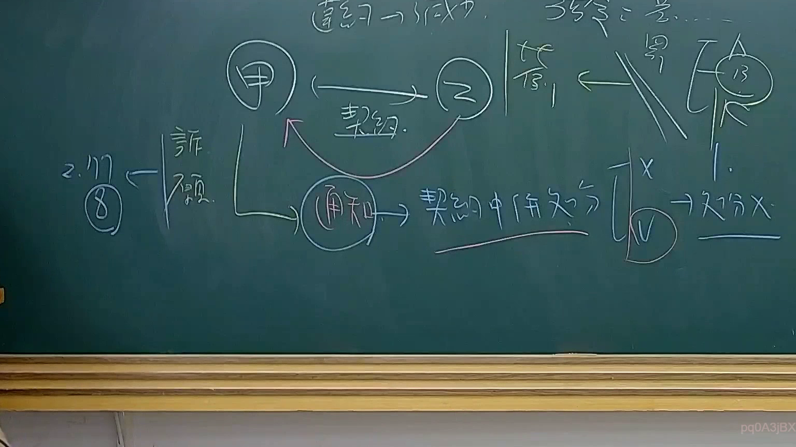

# 🎥 影音教材板書校對筆記
    - **來源影片**: [預約 34 2025-08-07 08-14-49-946](file:///J:/行政法A/ch34/預約 34 2025-08-07 08-14-49-946.mp4)
    - **課程分類**: `[行政法A`
    - **課堂章節**: `ch34]`
    - **影片時間戳記**: `01:36:45` (5805 秒)
    - **板書類型**: `影音板書`
    - **偵測時間**: 2026-07-22 03:21:15
    
    ## 🔍 擷取黑板板書對照圖
    
    
    ## 🧠 AI 智慧理解與知識庫演化註記
    ：

這張板書展示了「行政契約」與「行政處分」在法律救濟路徑上的複雜關係，特別是當行政機關（甲）與人民（乙）簽訂契約後，其後續的「通知」行為應如何定性的問題。

1.  **核心法律關係（行政契約）**：
    *   圖中上方顯示「甲」（行政機關）與「乙」（相對人）之間存在一個「契約」關係（行政契約，依據《行政程序法》第 135 條）。
    *   老師在最上方寫下「契約 → 成立」，代表雙方已達成合意。

2.  **爭點：通知之定性（契約中併處分）**：
    *   圖中下方顯示甲發出一個「通知」。這裡涉及行政法上的重要爭點：該通知僅是「履行契約的通知」（私法或公法契約行為），還是具備「行政處分」性質？
    *   板書標註了「契約中併處分」，這指的是行政機關在行政契約履行過程中，可能併隨發出一個具有高權性質的「行政處分」（依據《行政程序法》第 92 條）。

3.  **第三人（丙）的地位與救濟路徑**：
    *   圖右側出現「丙」，並標註了數字「13」，推測是指《訴願法》第 13 條（關於原處分機關之認定）或相關法律點。
    *   「丙」試圖介入（簽），但與契約主體間有雙斜線（代表阻隔或排除）。
    *   圖左側連結到「訴願」，並標註「2. 117 ⑧」。這可能指的是《行政程序法》第 117 條（違法行政處分之撤銷）之相關法理，或是特定教科書、講義的頁碼/條款，說明若該通知被視為行政處分，則不服者應走「訴願」程序進行救濟。

4.  **結論與判斷**：
    *   右下角的「X」與「V」及「處分 X」代表對於「該通知是否為行政處分」的否定與肯定見解。若該行為被定性為單純契約行為，則不能提起訴願（處分 X）；若具備處分性質，則可提起訴願。
    
    ## 📊 可編輯之 Mermaid 關係流程圖
    ```mermaid
    ：
graph TD
    subgraph "法律關係主體"
    A["甲 (行政機關)"]
    B["乙 (相對人)"]
    C["丙 (第三人)"]
    end

    A <--> |"1. 簽訂行政契約"| B
    A --> |"2. 發出通知"| D["通知"]
    
    D --> E["契約中併處分?"]
    E --> |"定性為處分"| F["提起訴願 (訴願法)"]
    E --> |"純屬契約執行"| G["契約爭執 (行政訴訟)"]

    F --- H["2. 117 ⑧ / 訴願法13"]
    
    C -.-> |"欲主張權利"| I["簽 / 剔"]
    I --- J["法律屏障/阻斷"]

    style D fill#f9f,stroke#333,stroke-width2px
    style E fill#fff,stroke#f00,stroke-width2px
    ```
    
    ## ✍️ 操作者手動校對修改區
    <!-- 您可以直接修改上方的文字或調整 Mermaid 區塊中的節點，Obsidian 會即時重新渲染 -->
    - [ ] 欄位結構與法律邏輯已校對無誤。
    - **校對筆記**: 
    