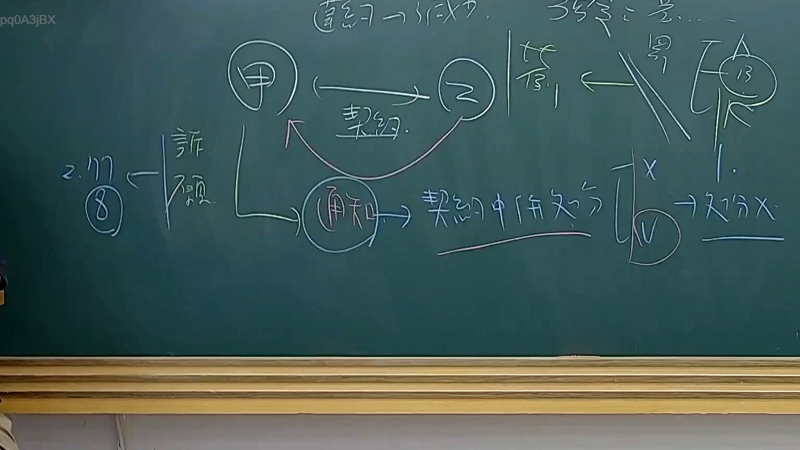

# 🎥 影音教材板書校對筆記
    - **來源影片**: [預約 34 2025-08-07 08-14-49-946](file:///J:/行政法A/ch34/預約 34 2025-08-07 08-14-49-946.mp4)
    - **課程分類**: `[行政法A`
    - **課堂章節**: `ch34]`
    - **影片時間戳記**: `01:38:45` (5925 秒)
    - **板書類型**: `影音板書`
    - **偵測時間**: 2026-07-22 03:21:32
    
    ## 🔍 擷取黑板板書對照圖
    
    
    ## 🧠 AI 智慧理解與知識庫演化註記
    ：
1. 【板書高精度 OCR】：
    *   主要角色：甲（圓圈）、乙（圓圈）。
    *   核心行為：契約（雙向箭頭）、違約（上方文字）、通知（圓圈）。
    *   法律邏輯：違約 -> 成立、公告 = ...、罰。
    *   法律救濟與性質辯證：訴願、2. 17 (8)、契約中條文、處分 X (打叉)、V (打勾)、處分 X。
    *   特定註記：右側有「陳」字及圓圈內的「13」，可能指涉特定法律實務見解（如最高行政法院 103 年決議）或特定學者見解。

2. 【詳細解讀與法條對照】：
    *   本板書探討的是「政府採購法」中，關於機關（甲）與廠商（乙）因契約履行發生爭議時，機關依《政府採購法》第101條發出的「通知」之法律性質。
    *   【私法契約 vs. 公法處分】：
        - 老師在板書中區分了該「通知」究係基於「契約中條文」的私法行為，還是屬於行政機關單方的「行政處分」。
        - 實務上（如板書右側標記的 103 年相關見解），機關依政府採購法第101條規定，將廠商刊登政府採購公報（黑名單處分）之通知，性質上被認定為「行政處分」。
    *   【法律條文對照】：
        - 《政府採購法》第101條：列舉廠商應刊登公報之情形。
        - 《政府採購法》第102條：廠商對通知不服之異議與申訴程序（此處申訴視同訴願）。
        - 《訴願法》：板書左側提及「訴願」，代表若認定為行政處分，廠商應循行政救濟途徑。
    *   【時效與程序】：
        - 左側「2. 17 (8)」與「訴願」之連線，可能在解說救濟期間的計算，或是特定法律條文的項次（如訴願法相關時效）。「公告」行為與「處罰」的關聯性，強調了行政行為的外部效力。
    
    ## 📊 可編輯之 Mermaid 關係流程圖
    ```mermaid
    ：
graph TD
    A["機關甲"] -- "簽署契約" --- B["廠商乙"]
    B -- "發生違約行為" --> A
    A -- "發出第101條通知" --> C["通知 (法律性質辨析)"]
    C -- "觀點一 私法行為" --> D["依契約條文執行"]
    C -- "觀點二 公法行為" --> E["行政處分 (V)"]
    E -- "不服處分" --> F["救濟 異議/申訴/訴願"]
    F -- "程序時效" --> G["2. 17 (8)"]
    H["最高行政法院 103年決議 (陳)"] -.-> E
    E -- "產生處罰效力" --> I["刊登政府採購公報/停權"]
    ```
    
    ## ✍️ 操作者手動校對修改區
    <!-- 您可以直接修改上方的文字或調整 Mermaid 區塊中的節點，Obsidian 會即時重新渲染 -->
    - [ ] 欄位結構與法律邏輯已校對無誤。
    - **校對筆記**: 
    