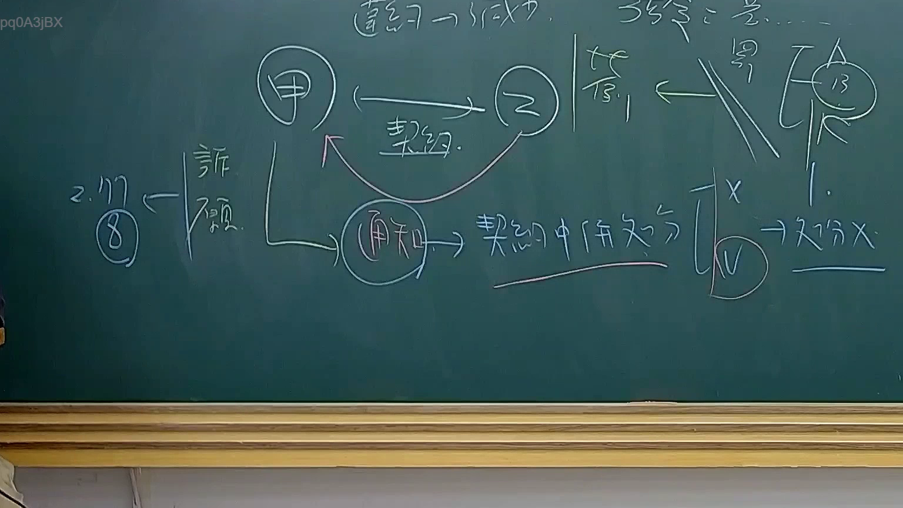

# 🎥 影音教材板書校對筆記
    - **來源影片**: [預約 34 2025-08-07 08-14-49-946](file:///J:/行政法A/ch34/預約 34 2025-08-07 08-14-49-946.mp4)
    - **課程分類**: `[行政法A`
    - **課堂章節**: `ch34]`
    - **影片時間戳記**: `01:40:00` (6000 秒)
    - **板書類型**: `影音板書`
    - **偵測時間**: 2026-07-22 03:22:05
    
    ## 🔍 擷取黑板板書對照圖
    
    
    ## 🧠 AI 智慧理解與知識庫演化註記
    ：

**1. 板書文字高精度辨識 (OCR)：**
*   **頂部中央：** (契約 -> 成立)
*   **核心人物：** 「甲」（圓圈內，代表行政機關）、「乙」（圓圈內，代表人民/契約相對人）。
*   **兩者關係：** 雙向箭頭標註「契約」，代表雙方締結行政契約。
*   **關鍵行為：** 「通知」（圓圈內），由「甲」發出。
*   **邏輯判斷：** 「契約中條文之分」引申出兩個分岔：
    *   「X」：非屬行政處分。
    *   「V」：屬行政處分。
    *   結論指向：「處分 X」（下方有雙底線強化）。
*   **左側註記：** 「2. 107 ⑧」指向「訴願」。
*   **右上區域：** 「落實」、「契約」，以及圓圈內的數字「13」。

**2. 法律學理與爭點解說：**
*   **核心爭點：行政契約執行行為之定性。**
    本板書探討行政機關（甲）與人民（乙）在行政契約關係中，機關所為之「通知」行為（如終止契約、請求返還給付等），其法律性質究竟是「行政處分」還是「契約之履行行為」？
*   **107年8月聯席會議決議 (107年8月份庭長法官聯席會議)：**
    板書左側的「107 ⑧」即指此重要決議。該決議針對「行政機關基於行政契約所為之通知」做出統一見解。若該通知僅是行使契約上的權利（如行使解除權、違約金請求），則屬私法或公法上之「履行契約行為」，而非行使公權力之「行政處分」（即板書標示之處分 X）。
*   **救濟途徑對照：**
    *   若被定性為「處分 X」（非處分），則不可提起「訴願」（故箭頭標註訴願是為了說明此路不通）。
    *   人民若有不服，應直接向行政法院提起「行政訴訟」（通常是給付之訴或確認之訴），而非走訴願程序。
*   **法條對照：**
    *   **《行政程序法》第 135 條：** 公法上法律關係得以契約設定、變更或消滅之。
    *   **《行政程序法》第 137 條：** 雙務契約之對價關係。
    *   **《訴願法》第 3 條：** 定義行政處分。若行為不符處分定義，依訴願法第 77 條第 8 款應予不受理。
*   **右上「13」與「落實」：** 可能指《行政程序法》中關於契約之一般原則，或特定法律如《國有財產法》第 13 條等相關背景（視教學脈絡而定，但此處主要強調契約關係的實踐）。
    
    ## 📊 可編輯之 Mermaid 關係流程圖
    ```mermaid
    ：
graph TD
    subgraph "法律關係主體"
    A["甲 (行政機關)"] 
    B["乙 (人民/相對人)"]
    end

    A -- "締結行政契約" --- B
    
    A --> C["通知 (行為)"]
    
    subgraph "性質辨析邏輯"
    C --> D{"法律性質定性"}
    D -- "契約條文之執行" --> E["處分 X (非行政處分)"]
    D -- "高權行為 (例外)" --> F["處分 V (行政處分)"]
    end

    E --> G["救濟：提起行政訴訟 (給付/確認之訴)"]
    F --> H["救濟：提起訴願、撤銷訴訟"]
    
    I["最高行政法院 107年8月決議"] -.->|指引| E
    J["行政程序法 第135條"] -.->|依據| A

    style E fill#f96,stroke#333,stroke-width2px
    style I fill#fff,stroke#f00,stroke-dasharray 5 5
    ```
    
    ## ✍️ 操作者手動校對修改區
    <!-- 您可以直接修改上方的文字或調整 Mermaid 區塊中的節點，Obsidian 會即時重新渲染 -->
    - [ ] 欄位結構與法律邏輯已校對無誤。
    - **校對筆記**: 
    