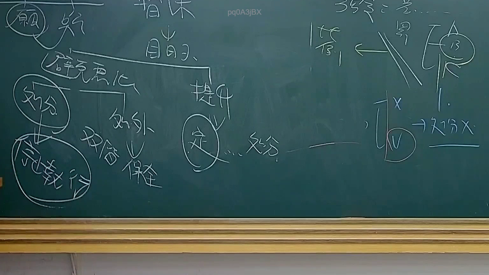

# 🎥 影音教材板書校對筆記
    - **來源影片**: [預約 34 2025-08-07 08-14-49-946](file:///J:/行政法A/ch34/預約 34 2025-08-07 08-14-49-946.mp4)
    - **課程分類**: `[行政法A`
    - **課堂章節**: `ch34]`
    - **影片時間戳記**: `02:06:45` (7605 秒)
    - **板書類型**: `影音板書`
    - **偵測時間**: 2026-07-22 03:22:17
    
    ## 🔍 擷取黑板板書對照圖
    
    
    ## 🧠 AI 智慧理解與知識庫演化註記
    ：

此板書主要探討臺灣行政法領域中，關於「爭訟救濟」與「處分」之間的邏輯關係，特別是針對行政處分之救濟途徑。

1. **文字辨識內容**：
   - 左側：包含「願」、「處分」、「強制執行」、「壁壘惡化」、「處外」、「雙階理論」等。
   - 中間：包含「目的」、「提升」、「定」、「處分」等。
   - 右側：包含「答」、「訴」、「1.」、「處分X」（處分被撤銷或無效）。

2. **法律學理分析**：
   - **雙階理論 (Dual-stage Theory)**：板書提到的「雙階理論」是行政法處理公私法混合契約或補助金發放的重要理論。第一階段是決定是否給予補助（行政處分），第二階段是後續的行政契約簽訂與履行。
   - **處分救濟與執行**：板書中出現「處分」與「強制執行」的連接，對應《行政執行法》第11條，行政處分若具備執行力，行政機關可逕為強制執行。
   - **救濟邏輯**：右側提到的「訴」（訴願）與「處分X」呈現了行政救濟的核心流程——針對行政處分提起爭訟，若處分違法，經由訴願或行政訴訟後，該處分可能被撤銷（處分X）。
   - **壁壘與定分**：板書提及「壁壘惡化」、「定」、「提升」，應是指在行政救濟過程中，如何透過訴願決定或判決來「定分止爭」（確定行政法律關係）。

3. **法律條文對照**：
   - **行政訴訟法第4條**：撤銷訴訟之提起，須以「處分」為前提。板書右側「處分 -> X」反映了撤銷訴訟的結果。
   - **行政程序法第92條**：定義了行政處分之構成要件。
   - **訴願法第1條**：人民對於中央或地方機關之行政處分，認為違法或不當，致損害其權利或利益者，得依法提起訴願。
    
    ## 📊 可編輯之 Mermaid 關係流程圖
    ```mermaid
    ：

graph TD
    A["行政處分"] --> B{"爭訟途徑"}
    B --> C["訴願"]
    B --> D["行政訴訟"]
    C --> E["撤銷處分/變更處分"]
    D --> F["判決結果"]
    F --> G["維持原處分"]
    F --> H["撤銷處分 (處分X)"]
    I["雙階理論"] --> J["第一階段 授益處分"]
    J --> K["第二階段 行政契約"]
    K --> L["強制執行"]
    ```
    
    ## ✍️ 操作者手動校對修改區
    <!-- 您可以直接修改上方的文字或調整 Mermaid 區塊中的節點，Obsidian 會即時重新渲染 -->
    - [ ] 欄位結構與法律邏輯已校對無誤。
    - **校對筆記**: 
    