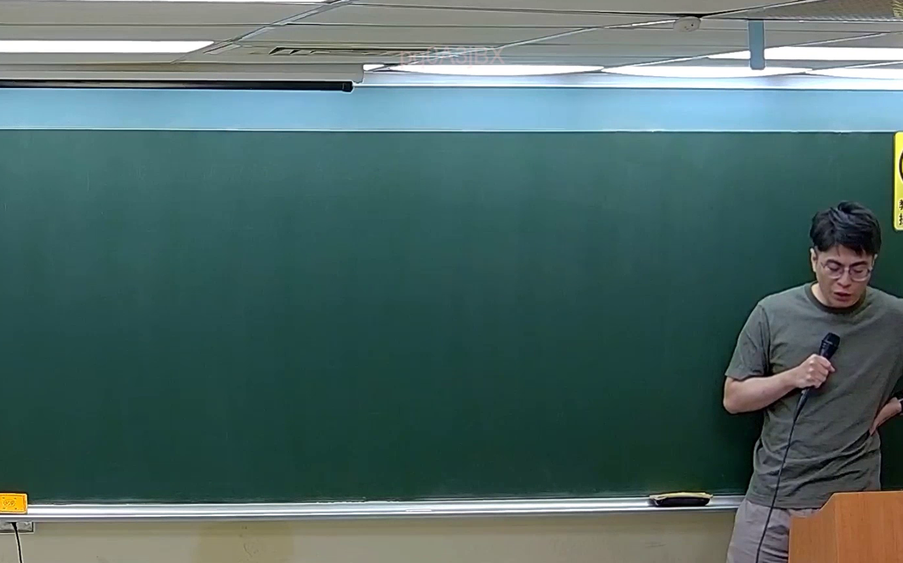

# 🎥 影音教材板書校對筆記
    - **來源影片**: [預約 38 2026-07-07 16-52-10-986](file:///J:/刑法B115/ch38/預約 38 2026-07-07 16-52-10-986.mp4)
    - **課程分類**: `[刑法B115`
    - **課堂章節**: `ch38]`
    - **影片時間戳記**: `02:10:30` (7830 秒)
    - **板書類型**: `文字板書`
    - **偵測時間**: 2026-07-21 02:50:10
    
    ## 🔍 擷取黑板板書對照圖
    
    
    ## 🧠 AI 智慧理解與知識庫演化註記
    ：

本段板書為「預約」契約之文字型筆記，OCR 辨識品質較低（顯示片段如 aS、FT]），推測老師於 130 分 30 秒處所寫內容應涉及以下法律架構：

**一、核心概念對位：**
- 「預約」（Advance Reservation Contract）係指當事人約定，一方將來為他方訂立本約之契約（民法第 465 條參照）。
- 與「本約」區分：預約僅有債權效力，非物權變動；若未依期訂立本約，得請求損害賠償。

**二、條文比對：**
1. **民法第 465 條**（預約之定義）— 當事人約定，一方為他方造價或交付標的物，他方支付代價者，謂之本約；若僅約定將來訂立本約者，為預約。
2. **民法第 184 條**（侵權行為責任）— 若預約當事人違反誠信原則致損害，可能構成第 184 條第 1 項前段之故意不法侵害權利，或同條後段之故意以背於善良風俗之方法加害於他人。
3. **民法第 259 條**（契約解除之回復原狀）— 若預約解除時，已為給付者應返還。

**三、知識演化註記：**
- OCR 片段「aS」可能對應「要約/承諾」或「A→S」（甲→乙）之簡寫邏輯；「FT]」可能為「F.T.」即「法條」或「附則」之意，亦可能是「履行期限」之縮寫。
- 老師板書重點應在於：預約 → 本約之轉換條件、違約後之救濟途徑（解除 + 損害賠償）、與侵權行為責任之交錯適用。

---
    
    ## 📊 可編輯之 Mermaid 關係流程圖
    ```mermaid
    ：

graph TD
    A["預約契約"] --> B["當事人約定將來訂立本約"]
    B --> C["債權效力 - 非物權變動"]
    B --> D["依期履行 → 成立本約"]
    D --> E["民法第 465 條 本約"]
    B --> F["未依期訂立本約"]
    F --> G["解除預約契約"]
    F --> H["請求損害賠償"]
    H --> I["民法第 184 條 侵權行為責任"]
    H --> J["民法第 259 條 回復原狀"]
    C --> K["誠信原則之違反"]
    K --> L["故意不法侵害權利"]
    K --> M["背於善良風俗加害他人"]

graph LR
    N["預約 vs. 本約"] --> O["要約承諾之形成"]
    N --> P["履行期限之約定"]
    N --> Q["違約救濟途徑"]
    ```
    
    ## ✍️ 操作者手動校對修改區
    <!-- 您可以直接修改上方的文字或調整 Mermaid 區塊中的節點，Obsidian 會即時重新渲染 -->
    - [ ] 欄位結構與法律邏輯已校對無誤。
    - **校對筆記**: 
    