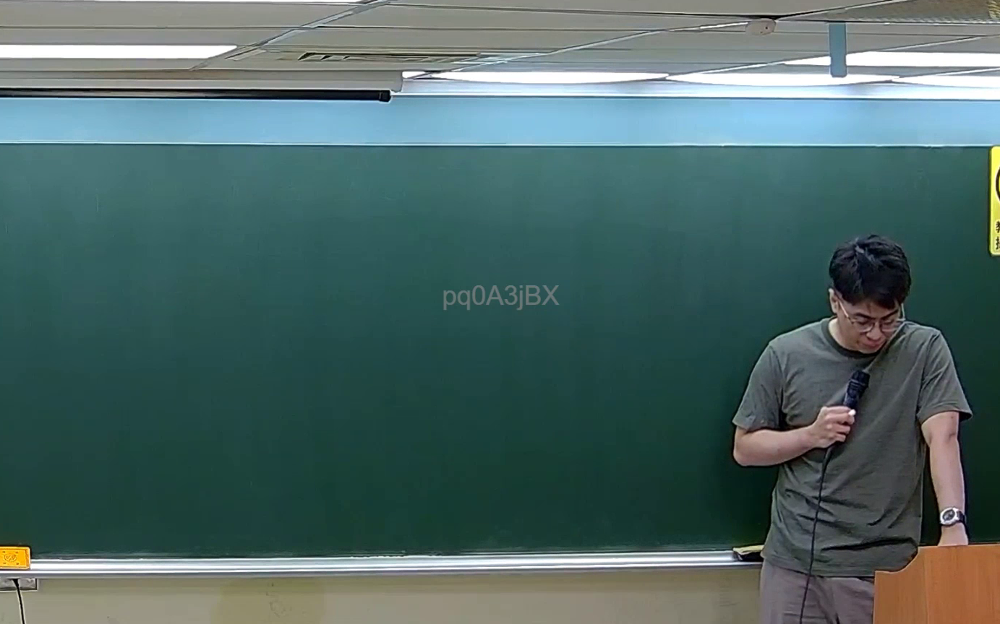

# 🎥 影音教材板書校對筆記
    - **來源影片**: [預約 38 2026-07-07 16-52-10-986](file:///J:/刑法B115/ch38/預約 38 2026-07-07 16-52-10-986.mp4)
    - **課程分類**: `[刑法B115`
    - **課堂章節**: `ch38]`
    - **影片時間戳記**: `02:19:30` (8370 秒)
    - **板書類型**: `關係圖/邏輯圖板書`
    - **偵測時間**: 2026-07-21 02:51:08
    
    ## 🔍 擷取黑板板書對照圖
    
    
    ## 🧠 AI 智慧理解與知識庫演化註記
    ：

您好，您的訊息中「擷取區域的 OCR 辨識字元」部分為空白——沒有實際的文字內容可供分析。因此我無法進行以下工作：

1. **語意整理**：無文字則無語義可解析。
2. **條文比對**（如民法第184條、侵權行為、消滅時效等）：需先有板書文字才能與現行法條對位。
3. **Mermaid 圖表生成**：關係圖/邏輯樹皆依賴辨識出的節點與箭頭結構。

---
    
    ## 📊 可編輯之 Mermaid 關係流程圖
    ```mermaid
    ：

（待您補充 OCR 辨識字元後，我將立即為您生成對應的 Mermaid 流程圖。）

---

📌 **請重新貼上板書上的 OCR 文字**，例如：
> 「甲請求乙賠償新臺幣100萬元，於2024年3月1日發生事故，2025年6月1日起訴。」

收到後我會立刻完成法律條文比對與 Mermaid 圖表生成。
    ```
    
    ## ✍️ 操作者手動校對修改區
    <!-- 您可以直接修改上方的文字或調整 Mermaid 區塊中的節點，Obsidian 會即時重新渲染 -->
    - [ ] 欄位結構與法律邏輯已校對無誤。
    - **校對筆記**: 
    