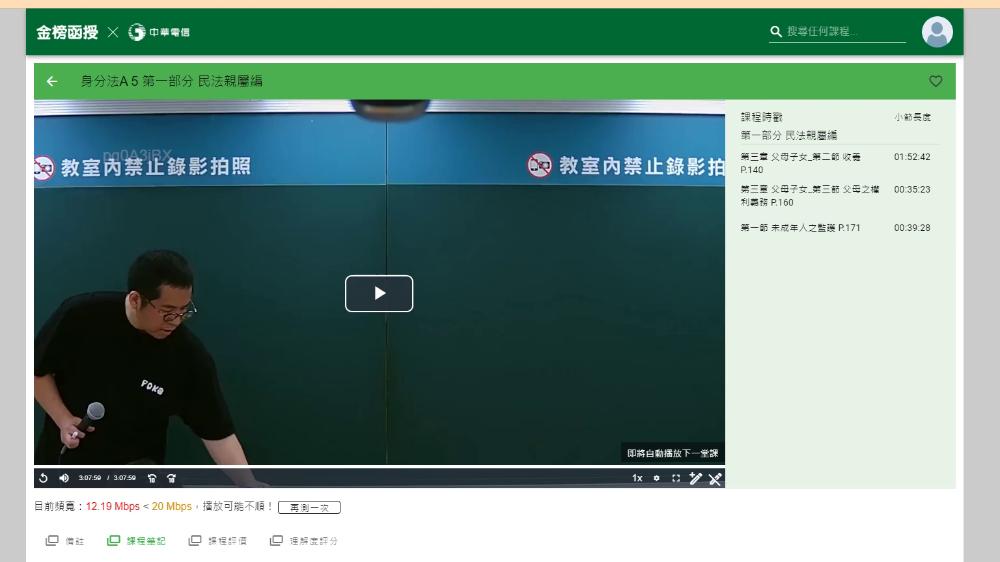

# 🎥 影音教材板書校對筆記
- **來源影片**: [預約 4 2024-09-21 12-49-21-989](file:///J:/身分法/ch4/預約 4 2024-09-21 12-49-21-989.mp4)
- **課程分類**: `[身分法`
- **課堂章節**: `ch4]`
- **影片時間戳記**: `02:27:00` (8820 秒)
- **板書類型**: `影音板書`
- **偵測時間**: 2026-07-19 17:15:16

## 🔍 擷取黑板板書對照圖


## 🧠 AI 智慧理解與知識庫演化註記
：
根據您提供的影音截圖畫面，該畫面為線上教學平台「金榜函授」的播放介面，目前顯示的課程為《身分法 A 5 第一部分 民法親屬編》。

1. **OCR 辨識結果**：
   - 課程名稱：身分法 A 5 第一部分 民法親屬編
   - 側邊欄目錄：
     - 第三章 父母子女_第二節 收養 P.140 (時間戳記：01:52:42)
     - 第三章 父母子女_第三節 父母之權利義務 P.160 (時間戳記：00:35:23)
     - 第一節 未成年人之監護 P.171 (時間戳記：00:39:28)

2. **法律學理與法條對照**：
   - 此課程章節主要集中於民法第四編「親屬編」。
   - **收養 (民法第1072條至第1083條之1)**：涉及養父母與養子女間的擬制血親關係。核心爭點常包含收養之要件（如需法院認可、是否有違背子女利益等）。
   - **父母之權利義務 (民法第1084條至第1090條)**：即一般所稱之「親權」。民法第1084條第2項規定，父母對於未成年子女有保護及教養之權利義務。
   - **未成年人之監護 (民法第1091條至第1113條)**：當父母均不能行使、負擔對於未成年子女之權利義務，或父母死亡時，應置監護人。此為保障未成年人權益之重要機制。

## 📊 可編輯之 Mermaid 關係流程圖
```mermaid
：
graph TD
    A["民法親屬編"] --> B["第三章 父母子女"]
    B --> B1["第二節 收養"]
    B --> B2["第三節 父母之權利義務"]
    A --> C["未成年人之監護"]
    B1 --> D["擬制血親關係"]
    B2 --> E["親權之保護與教養"]
    C --> F["監護人選任"]
```

## ✍️ 操作者手動校對修改區
<!-- 您可以直接修改上方的文字或調整 Mermaid 區塊中的節點，Obsidian 會即時重新渲染 -->
- [ ] 欄位結構與法律邏輯已校對無誤。
- **校對筆記**: 
