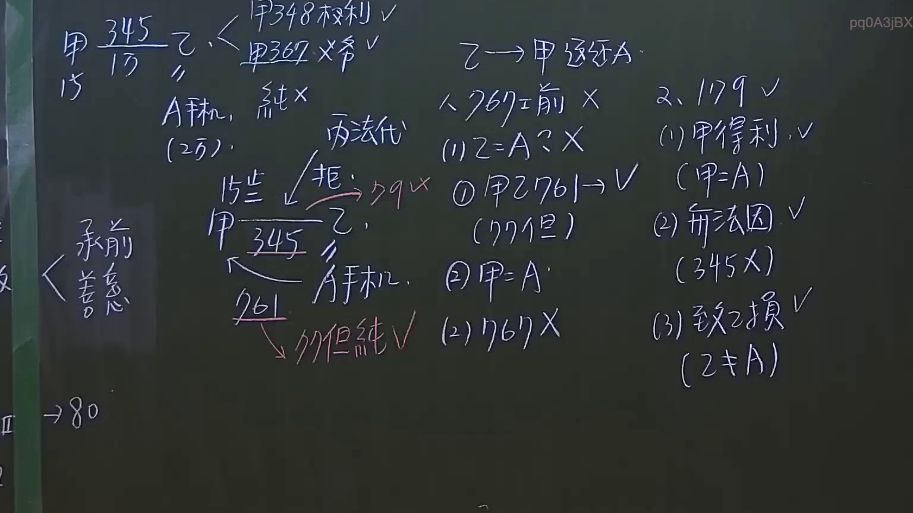
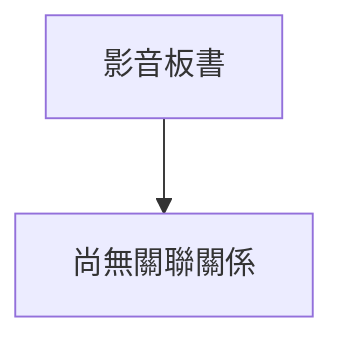

# 🎥 影音教材板書校對筆記
- **來源影片**: [預約 4 2024-10-18 08-50-49-964](file:///J:/民法/ch4/預約 4 2024-10-18 08-50-49-964.mp4)
- **課程分類**: `[民法`
- **課堂章節**: `ch4]`
- **影片時間戳記**: `02:12:30` (7950 秒)
- **板書類型**: `文字板書`
- **偵測時間**: 2026-07-14 19:55:00

## 🔍 擷取黑板板書對照圖

## 🧠 AI 智慧理解與知識庫演化註記
（無法取得本地大模型之智能註記分析）

## 📊 可編輯之 Mermaid 關係流程圖

## ✍️ 操作者手動校對修改區
<!-- 您可以直接修改上方的文字或調整 Mermaid 區塊中的節點，Obsidian 會即時重新渲染 -->
- [ ] 欄位結構與法律邏輯已校對無誤。
- **校對筆記**: 
