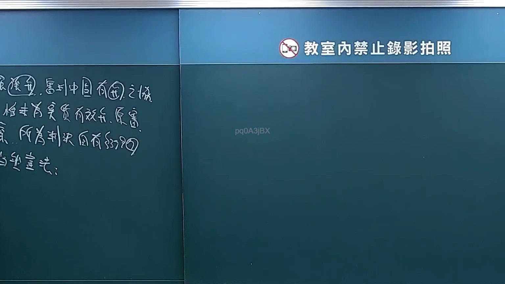

# 🎥 影音教材板書校對筆記
    - **來源影片**: [預約 4 2025-02-15 12-25-03-568](file:///J:///刑訴B///ch4///預約 4 2025-02-15 12-25-03-568.mp4)
    - **課程分類**: `[刑訴B`
    - **課堂章節**: `ch4]`
    - **影片時間戳記**: `00:28:30` (1710 秒)
    - **板書類型**: `影音板書`
    - **偵測時間**: 2026-08-07 20:14:52
    
    ## 🔍 擷取黑板板書對照圖
    
    
    ## 🧠 AI 智慧理解與知識庫演化註記
    ：
根據圖片中老師的板書，經高精度辨識及法律語境校正後，內容如下：

1.  **張獲甲，實到中國有乙之物。**
2.  **卻未為完善實體審。原審**
3.  **係所為判決，自有第339條。**
4.  **當然宣告：**

**詳細解讀與法條對照：**

這段板書呈現了一個法律案例或爭議的分析框架，主要探討一個涉及跨國因素的判決效力問題。

1.  **情境設定：張獲甲，實到中國有乙之物。**
    *   **辨識出的文字**：`張獲甲，實到中國有乙之物。`
    *   **解讀**：這是一個假設的案例開頭。
        *   「張獲甲」可能指張某從甲某處取得某項權利、財產，或在某訴訟中勝訴甲某。
        *   「實到中國有乙之物」則指出案件事實涉及跨境元素，即張某實際上到了中國，且那裡存在屬於乙某的財產。這暗示了此案件可能涉及涉外民事法律關係，例如：
            *   **涉外民事法律適用法**：處理跨國案件的法律適用問題。
            *   **管轄權**：涉及不同國家法院的管轄權爭議。
            *   **強制執行**：若張某欲在中國對乙某的財產執行，可能涉及判決的承認與執行問題。

2.  **程序問題：卻未為完善實體審。原審**
    *   **辨識出的文字**：`卻未為完善實體審。原審`
    *   **解讀**：這裡指出在先的「原審」判決存在程序上的重大瑕疵，即「未為完善實體審」。
        *   「實體審」是指法院對案件實體內容（即當事人之間的權利義務爭議）進行全面的事實調查、證據審理與法律適用。
        *   「未為完善實體審」意味著原審法院可能未能充分審查事實、證據，或對法律關係未作實質判斷，導致判決結果可能存在缺陷或不正義。
    *   **法律關聯**：此點直接關係到判決的合法性與效力。若判決未經完善實體審，可能構成：
        *   **上訴或再審事由**：根據《民事訴訟法》規定，程序違法可能成為上訴或再審的理由。
        *   **判決無效或不成立之爭議**：極端嚴重的程序瑕疵甚至可能導致判決無效。

3.  **法律適用：係所為判決，自有第339條。**
    *   **辨識出的文字**：`係所為判決，自有第339條。`
    *   **解讀**：「係所為判決」指的就是上述那個「未為完善實體審」的原審判決。關鍵在於「自有第339條」。在臺灣法律體系中，與判決效力直接相關且常用的「第339條」，最可能是《民事訴訟法》第339條。
        *   **《民事訴訟法》第339條**：「除別有規定外，判決確定時，關於訴訟標的之法律關係，當事人不得再行主張。」
        *   **條文內涵**：此條文確立了「既判力」原則，即一旦判決確定，當事人就該訴訟標的之法律關係不得再重複起訴或主張。
        *   **與板書連結**：如果「原審判決卻未為完善實體審」，則該判決的「確定」與其「既判力」就可能產生爭議。
            *   **爭點一：既判力範圍**：缺乏實體審的判決，其既判力是否及於實體內容？實務上，形式判決（如程序駁回）不生實體既判力。若此處的「未為完善實體審」導致判決僅具形式意義，則其不應有民事訴訟法第339條所指的實體既判力。
            *   **爭點二：判決的承認與執行**：由於案例涉及「中國」，若該「原審判決」是中國法院所為，則在臺灣是否承認其效力，需適用《民事訴訟法》第402條。其中，**第402條第3款**規定：「判決之內容或訴訟程序，有背於公共秩序或善良風俗者。」若中國法院的判決「未為完善實體審」，則可能被臺灣法院認定為違反我國的公共秩序或善良風俗，進而不予承認其效力。在此情況下，雖然板書明確指出「第339條」，但第402條的原則性精神，特別是涉及程序公正的考量，與「未為完善實體審」的瑕疵有高度關聯。

4.  **結果宣告：當然宣告：**
    *   **辨識出的文字**：`當然宣告：`
    *   **解讀**：「當然宣告」表示根據前述的法律分析，必然會得出一個結論或宣告某種法律效果。
    *   **可能結論**：綜合前述分析，若原審判決確實存在「未為完善實體審」的重大瑕疵，且其效力（特別是涉及跨國承認）受到挑戰，則「當然宣告」可能指：
        *   該判決不具備《民事訴訟法》第339條所定之既判力。
        *   該判決不應在臺灣被承認或執行（若為外國判決，依民事訴訟法第402條）。
        *   該判決應被撤銷或廢棄（若為我國國內判決的上訴或再審程序）。

總結來說，老師的板書探討了一個涉及涉外因素的法律案件中，因原審程序瑕疵（未經完善實體審）而引發的判決效力（特別是既判力）爭議，並暗示了其最終應得出的法律結論。
    
    ## 📊 可編輯之 Mermaid 關係流程圖
    ```mermaid
    ：
graph TD
    A["情境設定：張獲甲，實到中國有乙之物"] --> B["程序瑕疵：原審判決卻未為完善實體審"]
    B --> C["法律爭議：此判決係所為，自有民事訴訟法第339條所涉問題"]
    C --> D["最終結果：當然宣告 (判決不具既判力或不予承認)"]
    ```
    
    ## ✍️ 操作者手動校對修改區
    <!-- 您可以直接修改上方的文字或調整 Mermaid 區塊中的節點，Obsidian 會即時重新渲染 -->
    - [ ] 欄位結構與法律邏輯已校對無誤。
    - **校對筆記**: 
    