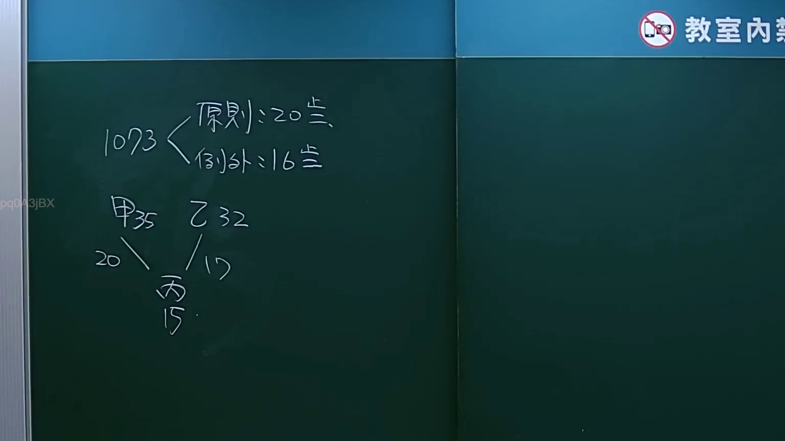

# 🎥 影音教材板書校對筆記
- **來源影片**: [預約 5 2024-09-21 17-16-40-925](file:///J:/身分法/ch5/預約 5 2024-09-21 17-16-40-925.mp4)
- **課程分類**: `[身分法`
- **課堂章節**: `ch5]`
- **影片時間戳記**: `00:04:00` (240 秒)
- **板書類型**: `影音板書`
- **偵測時間**: 2026-07-19 18:49:33

## 🔍 擷取黑板板書對照圖


## 🧠 AI 智慧理解與知識庫演化註記
：
1. **板書內容辨識**：
   - 1073 (指民法第1073條)
   - 原則：20歲
   - 例外：16歲
   - 甲 (35歲)、乙 (32歲)
   - 丙 (15歲)
   - 關係：甲對丙為20歲（歲數差距），乙對丙為17歲（歲數差距）。

2. **法條對照與法律學理**：
   - 本板書探討的是《民法》第1073條關於「收養」的規定，重點在於收養者與被收養者之間的「年齡差距」。
   - **民法第1073條第1項**規定：「收養者之年齡應長於被收養者二十歲以上。」此為一般原則（即板書之「原則：20歲」）。
   - **民法第1073條第2項**規定：「但夫妻共同收養時，夫妻之一方長於被收養者二十歲以上，而他方長於被收養者十六歲以上，亦得收養。」此為特殊例外（即板書之「例外：16歲」）。
   - 案例分析：
     - 甲 (35歲) 與 丙 (15歲) 相差 20歲，符合民法第1073條第1項規定。
     - 若為共同收養（假設甲、乙為夫妻），乙 (32歲) 與 丙 (15歲) 相差 17歲，符合第1073條第2項「他方長於被收養者十六歲以上」之規定。此板書在說明收養年齡限制的構成要件分析。

## 📊 可編輯之 Mermaid 關係流程圖
```mermaid
：
graph TD
    A["民法第1073條收養限制"] --> B["原則：20歲差距"]
    A --> C["例外：夫妻共同收養"]
    C --> D["一方需≧20歲差距"]
    C --> E["他方需≧16歲差距"]
    F["甲 (35歲)"] -- "差距 20歲" --> H["丙 (15歲)"]
    G["乙 (32歲)"] -- "差距 17歲" --> H["丙 (15歲)"]
```

## ✍️ 操作者手動校對修改區
<!-- 您可以直接修改上方的文字或調整 Mermaid 區塊中的節點，Obsidian 會即時重新渲染 -->
- [ ] 欄位結構與法律邏輯已校對無誤。
- **校對筆記**: 
