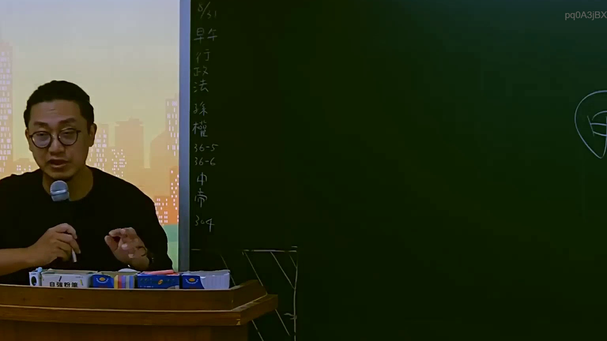

# 🎥 影音教材板書校對筆記
    - **來源影片**: [預約 5 2025-07-23 14-34-22-236](file:///J:/行政法A/ch5/預約 5 2025-07-23 14-34-22-236.mp4)
    - **課程分類**: `[行政法A`
    - **課堂章節**: `ch5]`
    - **影片時間戳記**: `00:23:30` (1410 秒)
    - **板書類型**: `影音板書`
    - **偵測時間**: 2026-07-22 04:24:34
    
    ## 🔍 擷取黑板板書對照圖
    
    
    ## 🧠 AI 智慧理解與知識庫演化註記
    ：
1. 板書文字高精度 OCR 辨識結果：
   - 8/31
   - 早期行政法
   - 採權
   - 36-5
   - 36-6
   - 中市
   - 304

2. 法律學理與法條對照分析：
   - 畫面右側可隱約看見「甲」字，左側黑板則列出日期「8/31」、行政法學理發展脈絡（「早期行政法」）、相關條文或釋字（如「36-5」、「36-6」、「304」），並提及「採權」（應為「釋憲權」或特定權利保障之簡寫）與地方自治相關字眼（「中市」）。
   - 對應臺灣現行法規，此處主要涉及行政法學基礎、行政訴訟法或大法官解釋（憲法法庭裁判）中關於權利救濟與行政處分違法救濟之體系。例如行政訴訟法第36條之5、第36條之6等相關規定，或者是針對特定地方自治團體（如臺中市，簡稱「中市」）之自治條例或行政處分的爭訟案例研討。
    
    ## 📊 可編輯之 Mermaid 關係流程圖
    ```mermaid
    ：
graph TD
    A["早期行政法"] --> B["採權與救濟體系"]
    B --> C["行政訴訟法相關條文"]
    C --> D["36-5"]
    C --> E["36-6"]
    B --> F["地方自治案例"]
    F --> G["中市"]
    G --> H["304"]
    ```
    
    ## ✍️ 操作者手動校對修改區
    <!-- 您可以直接修改上方的文字或調整 Mermaid 區塊中的節點，Obsidian 會即時重新渲染 -->
    - [ ] 欄位結構與法律邏輯已校對無誤。
    - **校對筆記**: 
    