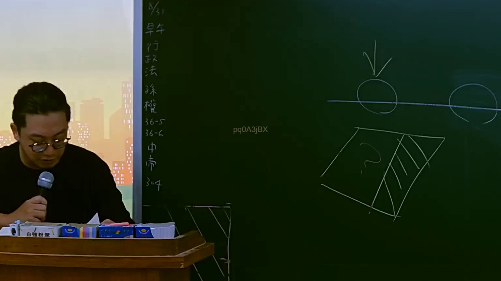

# 🎥 影音教材板書校對筆記
    - **來源影片**: [預約 5 2025-07-23 14-34-22-236](file:///J:/行政法A/ch5/預約 5 2025-07-23 14-34-22-236.mp4)
    - **課程分類**: `[行政法A`
    - **課堂章節**: `ch5]`
    - **影片時間戳記**: `00:38:30` (2310 秒)
    - **板書類型**: `影音板書`
    - **偵測時間**: 2026-07-22 04:24:44
    
    ## 🔍 擷取黑板板書對照圖
    
    
    ## 🧠 AI 智慧理解與知識庫演化註記
    ：
1. 板書文字辨識：
   畫面左側直書文字為：「8/31 早、行、政、法、釋、權、36-5、36-6、中、市、304」。
   畫面右側則繪有圖形示意，包含一條水平線與圓形（象徵某種權利主體、狀態或基準線）、向下箭頭，以及下方帶有問號與斜線陰影的方框圖形，暗示行政法上的權利救濟、行政訴訟法相關條文（如司法院釋字、行政訴訟法第36條之5、第36條之6等）或地方自治法規（如台中市相關法規或自治條例）的爭點剖析。

2. 法律學理與法條對照：
   - 釋字與行政訴訟法：板書中出現「釋權」（可能指釋憲、解釋權或相關大法官解釋）、「36-5」、「36-6」，在現行法制中常對應至《行政訴訟法》或相關訴訟程序與救濟條文的檢討。
   - 行政法學理與地方制度：搭配「台中市」（中市）與「304」（可能指地方制度法第304條或其他行政法規條次），顯示老師正在講解關於地方自治團體與中央之權限劃分、行政處分之合法性、或是行政救濟程序中的請求權基礎與管轄權爭議。
   - 圖形邏輯：右側的圖形示意（水平線上的圓形與向下箭頭、下方標示問號及陰影的區塊）通常用於拆解行政行為之侵害、法律效果的切分、或是請求權與救濟途徑（如撤銷訴訟與一般給付訴訟）的範圍界線。
    
    ## 📊 可編輯之 Mermaid 關係流程圖
    ```mermaid
    ：
graph TD
    A["8/31 課程單元"] --> B["行政法"]
    B --> C["釋字與相關解釋權"]
    B --> D["行政訴訟法 36-5 / 36-6"]
    B --> E["台中市地方自治與法規 304"]
    C --> F["權利救濟與實體法對照"]
    D --> F
    E --> F
    F --> G["圖形解析：行政行為與侵害範圍"]
    ```
    
    ## ✍️ 操作者手動校對修改區
    <!-- 您可以直接修改上方的文字或調整 Mermaid 區塊中的節點，Obsidian 會即時重新渲染 -->
    - [ ] 欄位結構與法律邏輯已校對無誤。
    - **校對筆記**: 
    