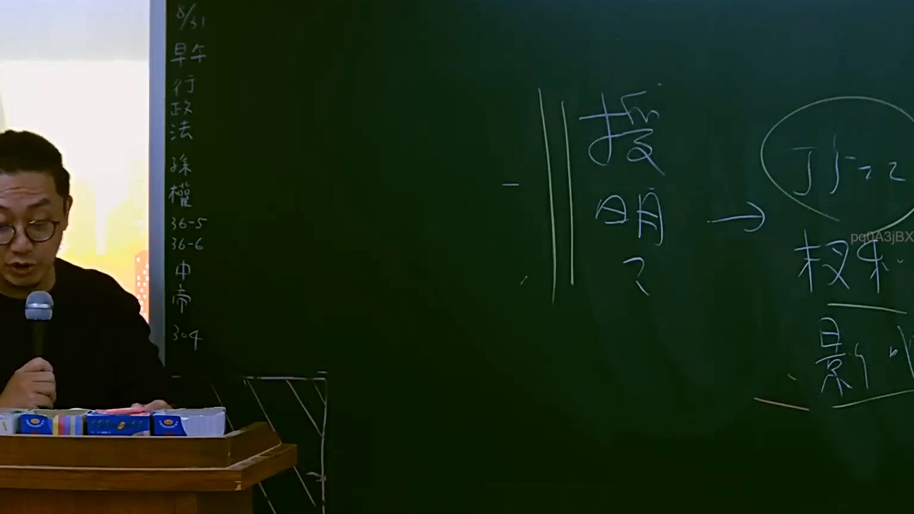

# 🎥 影音教材板書校對筆記
    - **來源影片**: [預約 5 2025-07-23 14-34-22-236](file:///J:/行政法A/ch5/預約 5 2025-07-23 14-34-22-236.mp4)
    - **課程分類**: `[行政法A`
    - **課堂章節**: `ch5]`
    - **影片時間戳記**: `01:11:30` (4290 秒)
    - **板書類型**: `影音板書`
    - **偵測時間**: 2026-07-22 04:24:57
    
    ## 🔍 擷取黑板板書對照圖
    
    
    ## 🧠 AI 智慧理解與知識庫演化註記
    ：
1. 板書文字辨識 (OCR)：
   - 左側直行筆記：包含「5/31」、「早午」、「行政法」、「孫權」、「36-5」、「36-6」、「中帝」、「304」等字樣。
   - 右側核心板書：「說明」、「授明？」（或授權）、箭頭「→」、圈選的「丁於」、「權利」、「影響」等字詞，探討授權行為或說明對於他人權利影響之法律關係。
2. 法律學理與法條對照：
   - 本板書涉及行政法或民法上關於「授權」、「行政處分之說明」或「權利義務變動」之法律效果。
   - 在行政法學理中，行政機關作成限制人民權益之處分前，通常須給予當事人陳述意見之機會（行政程序法第39條、第102條等），若涉及授權不明或說明義務違反，將影響行政處分的合法性。
   - 在民法財產法領域則可能涉及代理權授與（民法第167條以下）或無權處分、權利瑕疵等民事法理。
    
    ## 📊 可編輯之 Mermaid 關係流程圖
    ```mermaid
    ：
graph TD
A["說明與授權行為"] --> B["丁於之法律地位"]
B --> C["權利變動與影響"]
    ```
    
    ## ✍️ 操作者手動校對修改區
    <!-- 您可以直接修改上方的文字或調整 Mermaid 區塊中的節點，Obsidian 會即時重新渲染 -->
    - [ ] 欄位結構與法律邏輯已校對無誤。
    - **校對筆記**: 
    