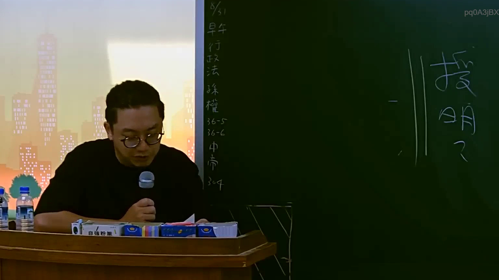

# 🎥 影音教材板書校對筆記
    - **來源影片**: [預約 5 2025-07-23 14-34-22-236](file:///J:/行政法A/ch5/預約 5 2025-07-23 14-34-22-236.mp4)
    - **課程分類**: `[行政法A`
    - **課堂章節**: `ch5]`
    - **影片時間戳記**: `01:14:15` (4455 秒)
    - **板書類型**: `影音板書`
    - **偵測時間**: 2026-07-22 04:25:07
    
    ## 🔍 擷取黑板板書對照圖
    
    
    ## 🧠 AI 智慧理解與知識庫演化註記
    ：
根據圖片中的板書內容，主要涵蓋了行政法與相關法律條文的解說：
1. OCR 辨識文字：
   - 左側直行：8/31、早、行政法、孫權、36-5、36-6、中帝、304
   - 右側大字：說明
2. 法律學理與條文對位：
   - 內容涉及行政程序法相關條文（如第36條有關職權調查主義：「行政機關應依職權調查證據，不受當事人主張之拘束...」、第36-5條、第36-6條等相關法條規定與實務運作）。
   - 課程脈絡可能為行政法總則或特定行政救濟程序的授課進度與筆記提示（包含日期 8/31、授課重點「說明」以及特定案例或學員代稱如「孫權」、「中帝」與教室代號「304」）。
    
    ## 📊 可編輯之 Mermaid 關係流程圖
    ```mermaid
    ：
graph TD
    A["行政法課程"] --> B["8/31 授課進度"]
    B --> C["行政程序法相關條文"]
    C --> D["第36-5條"]
    C --> E["第36-6條"]
    B --> F["課堂說明事項"]
    ```
    
    ## ✍️ 操作者手動校對修改區
    <!-- 您可以直接修改上方的文字或調整 Mermaid 區塊中的節點，Obsidian 會即時重新渲染 -->
    - [ ] 欄位結構與法律邏輯已校對無誤。
    - **校對筆記**: 
    