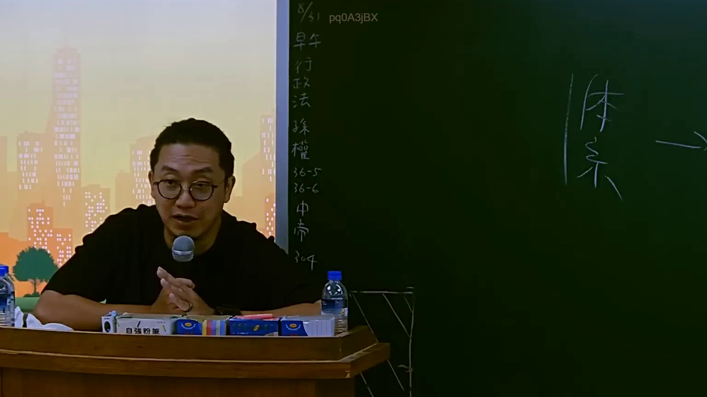

# 🎥 影音教材板書校對筆記
    - **來源影片**: [預約 5 2025-07-23 14-34-22-236](file:///J:/行政法A/ch5/預約 5 2025-07-23 14-34-22-236.mp4)
    - **課程分類**: `[行政法A`
    - **課堂章節**: `ch5]`
    - **影片時間戳記**: `01:47:00` (6420 秒)
    - **板書類型**: `影音板書`
    - **偵測時間**: 2026-07-22 04:25:17
    
    ## 🔍 擷取黑板板書對照圖
    
    
    ## 🧠 AI 智慧理解與知識庫演化註記
    ：
1. 【板書高精度 OCR】：
左側板書辨識：
- 8/31
- 早午
- 行政法
- 孫權
- 36-5
- 36-6
- 中帝
- 304

右側板書辨識：
- 體系 ->

2. 【詳細法律學理與法條對照】：
本畫面呈現的是行政法課程的板書與體系梳理。
- 關於法條定位：「36-5」、「36-6」與「孫權」（可能指涉特定行政法規或釋字、憲法法庭判決、訴願法、行政訴訟法或相關特別法之條文與實務見解代稱），搭配「體系 ->」提示，顯示老師正在引導學生建立行政法特定爭點的法學體系架構。
- 相關法條連結：行政程序法、行政訴訟法或訴願法中關於救濟、管轄或程序標的之規定。
    
    ## 📊 可編輯之 Mermaid 關係流程圖
    ```mermaid
    ：
graph TD
A["8/31 課程單元"] --> B["早午行政法"]
B --> C["孫權相關爭點"]
C --> D["法條研析"]
D --> E["第 36-5 條"]
D --> F["第 36-6 條"]
D --> G["中帝 304"]
C --> H["體系建構"]
    ```
    
    ## ✍️ 操作者手動校對修改區
    <!-- 您可以直接修改上方的文字或調整 Mermaid 區塊中的節點，Obsidian 會即時重新渲染 -->
    - [ ] 欄位結構與法律邏輯已校對無誤。
    - **校對筆記**: 
    