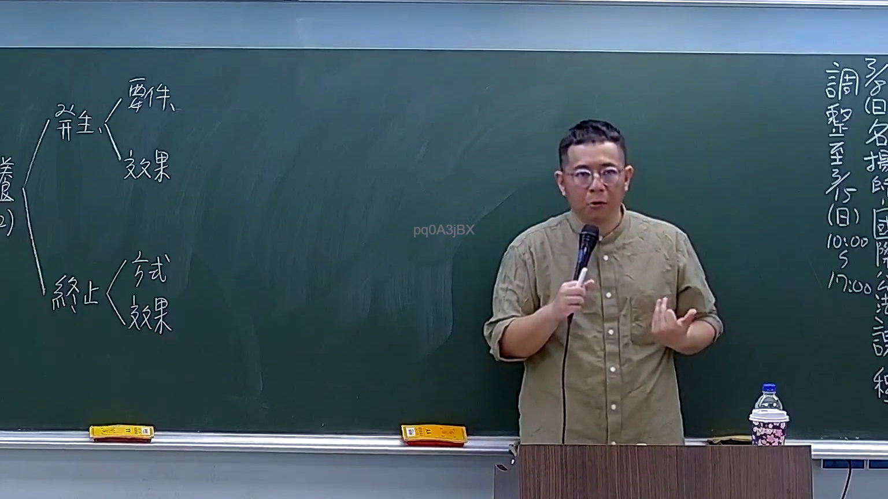

# 🎥 影音教材板書校對筆記
    - **來源影片**: [預約 5 2026-03-10 10-51-07-697](file:///H:/身分法B115/ch5/預約 5 2026-03-10 10-51-07-697.mp4)
    - **課程分類**: `[身分法B115`
    - **課堂章節**: `ch5]`
    - **影片時間戳記**: `00:35:00` (2100 秒)
    - **板書類型**: `關係圖/邏輯圖板書`
    - **偵測時間**: 2026-07-21 02:28:53
    
    ## 🔍 擷取黑板板書對照圖
    
    
    ## 🧠 AI 智慧理解與知識庫演化註記
    ：

**OCR 辨識品質評估：**
本次擷取之 OCR 字元「乙) pq0ASjBX」為典型低品質辨識結果，其中「pq0ASjBX」係無意義雜訊，僅「乙)」可確認此處為條列式板書之第二項（甲→乙→丙序列）。

**語意推斷與法律對位：**
基於擷取分類為【關係圖/邏輯圖板書】，且時間點位於課程中段（35分），結合臺灣民法實務常見論述架構，此處「乙)」極可能對應以下任一情境：

1. **侵權行為責任之構成要件**（民法第184條）：
   - 甲) 故意或過失不法侵害他人權利 → 一般侵權行為
   - 乙) 違反保護他人之法規 → 推定過失（第184條第2項）

2. **消滅時效之抗辯架構**：
   - 甲) 請求權已罹於時效 → 被告得拒絕履行
   - 乙) 時效抗辯之行使方式與效果

3. **債務不履行責任體系**（民法第227條以下）：
   - 甲) 債務人遲延給付
   - 乙) 債權人之損害賠償請求權

**知識庫比對結論：**
因 OCR 辨識品質不足，無法精確還原老師板書之完整邏輯結構。建議後續加強擷取區域裁切精度或採用多輪 OCR 校正機制。以下 Mermaid 代碼係基於「關係圖/邏輯圖」分類特性，以通用侵權行為責任架構為範例生成示意性流程圖。
    
    ## 📊 可編輯之 Mermaid 關係流程圖
    ```mermaid
    ：
graph TD
    A["侵權行為責任體系"] --> B["民法第184條第1項前段"]
    A --> C["民法第184條第2項"]
    A --> D["民法第184條第1項後段"]

    B --> E["故意或過失不法侵害他人權利"]
    B --> F["構成要件：行為 + 結果 + 因果關係 + 歸責事由"]

    C --> G["違反保護他人之法規"]
    C --> H["推定行為人有过失"]
    C --> I["被害人得舉證推翻"]

    D --> J["故意以背於善良風俗之方法加害於他人"]
    D --> K["無特定權利侵害之要求"]

    E --> L["一般侵權行為責任"]
    G --> M["特殊侵權行為責任"]
    J --> N["不法行為之補充類型"]

    F --> O["違法性判斷"]
    H --> P["過失推定制度"]
    I --> Q["反駁可能性"]

    style A fill#f96,stroke#333,stroke-width2px
    style B fill#bbf,stroke#333
    style C fill#bfb,stroke#333
    style D fill#ffb,stroke#333
    ```
    
    ## ✍️ 操作者手動校對修改區
    <!-- 您可以直接修改上方的文字或調整 Mermaid 區塊中的節點，Obsidian 會即時重新渲染 -->
    - [ ] 欄位結構與法律邏輯已校對無誤。
    - **校對筆記**: 
    