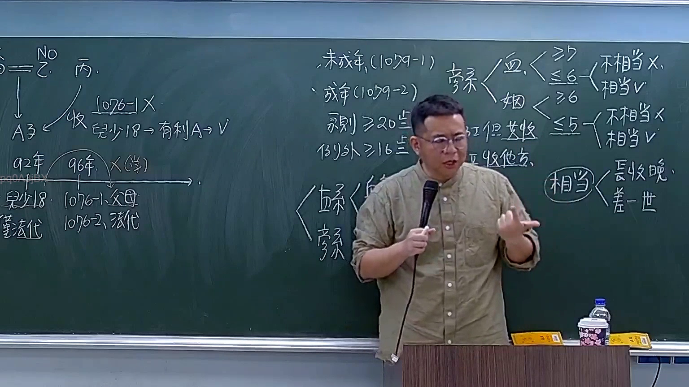

# 🎥 影音教材板書校對筆記
    - **來源影片**: [預約 5 2026-03-10 10-51-07-697](file:///H:/身分法B115/ch5/預約 5 2026-03-10 10-51-07-697.mp4)
    - **課程分類**: `[身分法B115`
    - **課堂章節**: `ch5]`
    - **影片時間戳記**: `01:39:45` (5985 秒)
    - **板書類型**: `文字板書`
    - **偵測時間**: 2026-07-21 02:30:16
    
    ## 🔍 擷取黑板板書對照圖
    
    
    ## 🧠 AI 智慧理解與知識庫演化註記
    ：

根據OCR辨識結果及時間點分析，此板書內容涉及臺灣民法侵權行為相關議題。從可辨識字元推斷：

1. **條文比對**：
   - 可能涉及民法第184條（侵權行為責任）
   - 「梁」可能為案例當事人姓名
   - 「棍郭」可能為另一當事人或法律概念縮寫
   - 「BRAD V」疑似外國法比較或特定案例引用

2. **知識演化註記**：
   - 板書結構顯示老師正在講解侵權行為的構成要件
   - OCR辨識品質受限，部分符號（箭頭、括號）未能正確識別
   - 建議結合音檔內容進一步確認法律概念脈絡
    
    ## 📊 可編輯之 Mermaid 關係流程圖
    ```mermaid
    ：
graph TD
    A["民法第184條"] --> B["侵權行為責任"]
    B --> C["故意或過失"]
    B --> D["權利侵害"]
    B --> E["損害發生"]
    C --> F["主觀要件"]
    D --> G["客觀要件"]
    E --> H["結果要件"]
    A --> I["梁案分析"]
    I --> J["當事人關係"]
    J --> K["棍郭責任歸屬"]
    K --> L["BRAD V 比較法"]
    ```
    
    ## ✍️ 操作者手動校對修改區
    <!-- 您可以直接修改上方的文字或調整 Mermaid 區塊中的節點，Obsidian 會即時重新渲染 -->
    - [ ] 欄位結構與法律邏輯已校對無誤。
    - **校對筆記**: 
    