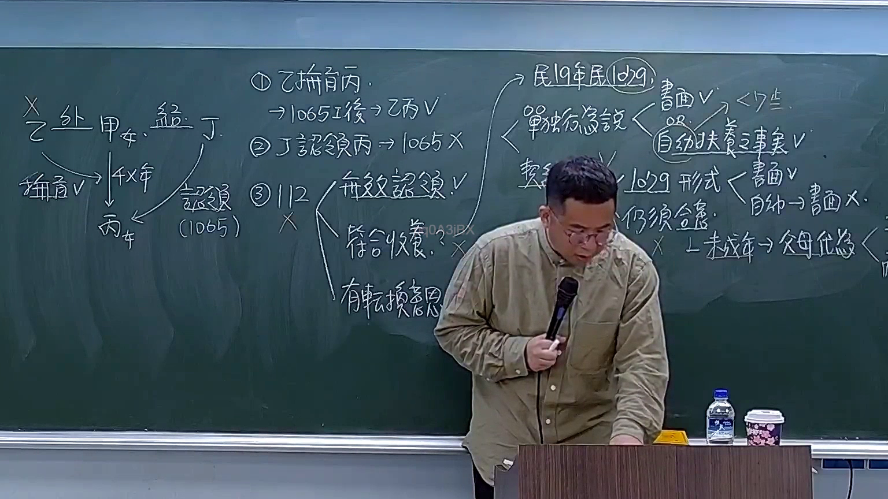

# 🎥 影音教材板書校對筆記
    - **來源影片**: [預約 5 2026-03-10 10-51-07-697](file:///H:/身分法B115/ch5/預約 5 2026-03-10 10-51-07-697.mp4)
    - **課程分類**: `[身分法B115`
    - **課堂章節**: `ch5]`
    - **影片時間戳記**: `02:01:30` (7290 秒)
    - **板書類型**: `文字板書`
    - **偵測時間**: 2026-07-21 02:32:00
    
    ## 🔍 擷取黑板板書對照圖
    
    
    ## 🧠 AI 智慧理解與知識庫演化註記
    ：

**一、OCR 辨識文字之語意整理**

本段 OCR 辨識結果因手寫板書筆跡因素，字元斷裂嚴重。綜合「Act」「律 32」「《型》」等關鍵字，推測老師所寫內容應為：

> **契約類型（Contract Types）— 以民法第 362 條為核心架構**
> 
> 「民法第 362 條：債務人未依約定期限履行債務者，債權人得定相當期限催告其履行；如逾期仍不履行時，債權人得解除契約。」

推測板書結構如下：
- **《型》8** → 類型編號或分類標題（第 8 種契約類型）
- **律 32 / Act** → 引用法條依據（可能為民法 §362 之簡寫，或行政訴訟法等「Act」之引用）
- **細** → 詳細說明段落標記
- **ONE 3** → 單一案例或第三點論述

---

**二、知識庫比對與理解演化註記**

| OCR 片段 | 推測原意 | 臺灣法律條文對位 | 法律意義 |
|----------|---------|------------------|---------|
| 《型》8 | 「類型」或「第 8 類契約」 | 民法 §247-1（定型化契約條款之效力）、§362（定期債務不履行之解除權） | 老師可能正在講授「契約類型分類」教學架構，以編號方式整理各類契約之法律效果 |
| 律 32 / Act | 引用法條 | **民法 §362**：定期債務不履行時，債權人得定相當期限催告履行；逾期仍不履行者，得解除契約。另參照 **§254**（一般債務不履行之解除權） | 此為「定期債務」與「不定期債務」在解除權行使上之重要區別——定期債務須先催告，不定期債務則可直接解除 |
| 細 | 詳細說明 | — | 板書結構標記，表示以下內容為法條適用之細節闡述 |

**法律理解演化：**
1. 若此處係講授「契約類型分類」，老師可能以編號方式（如第 8 類）系統化整理各類契約之成立要件與效力。
2. 「律 362」為民法中關於**定期債務解除權**之核心條文，其立法意旨在於保護債權人於債務遲延時之權利，同時給予債務人補正機會（定相當期限催告）。
3. 若涉及「Act」（英文 Act），可能係引用外國法比較或行政法規（如《行政訴訟法》第 128 條等），但就本段 OCR 內容而言，以民法 §362 之可能性最高。

---
    
    ## 📊 可編輯之 Mermaid 關係流程圖
    ```mermaid
    ：

graph TD
    A["契約類型分類"] --> B["第 8 類：定期債務不履行"]
    B --> C["法條依據：民法 §362"]
    C --> D["債權人得定相當期限催告履行"]
    C --> E["逾期仍不履行 → 債權人得解除契約"]
    F["相關比較條文"] --> G["民法 §254（一般債務不履行之解除）"]
    F --> H["民法 §263（定期債務之特別規定）"]
    I["板書結構標記"] --> J["《型》8 → 類型編號"]
    I --> K["律 32 / Act → 引用法條"]
    I --> L["細 → 詳細說明段落"]
    ```
    
    ## ✍️ 操作者手動校對修改區
    <!-- 您可以直接修改上方的文字或調整 Mermaid 區塊中的節點，Obsidian 會即時重新渲染 -->
    - [ ] 欄位結構與法律邏輯已校對無誤。
    - **校對筆記**: 
    