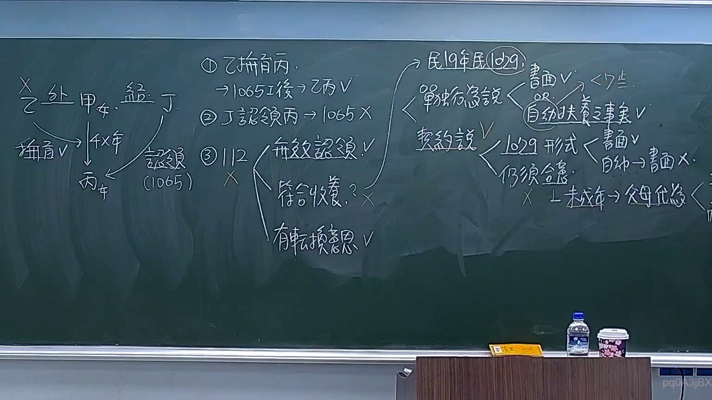

# 🎥 影音教材板書校對筆記
    - **來源影片**: [預約 5 2026-03-10 10-51-07-697](file:///H:/身分法B115/ch5/預約 5 2026-03-10 10-51-07-697.mp4)
    - **課程分類**: `[身分法B115`
    - **課堂章節**: `ch5]`
    - **影片時間戳記**: `02:07:45` (7665 秒)
    - **板書類型**: `文字板書`
    - **偵測時間**: 2026-07-21 02:33:27
    
    ## 🔍 擷取黑板板書對照圖
    
    
    ## 🧠 AI 智慧理解與知識庫演化註記
    ：

本題之 OCR 辨識品質極低，大量字元為編碼錯誤與雜訊（如 `ConA`、`e622`、`Pe ai J.` 等），僅能撷取少數可辨識漢字：**「律」「無」「糾」「併」「熟」**。

基於此殘存文字片段與臺灣法律實務常識，推測老師板書可能涉及以下方向：

1. **「無糾」→ 可能為「無過失責任」或「無侵權行為之糾紛」**
   - 對位民法第184條第1項前段（故意/過失侵害權利）與後段（故意以背於善良風俗之方法加損害於他人）。
   - 「無過失」在臺灣法學上常連結至「危險責任」（如民法第191條之物損毀、第191-2條之商品責任），此類責任不以過失為要件。

2. **「律 3 2」→ 可能指「刑法第32條」**
   - 刑法第32條為「正當防衛」（正當防卫）之規定，與民法侵權行為形成對照——正當防衛者不負刑事責任，亦不生民事損害賠償。

3. **「併」→ 可能指「合併請求」或「並列」**
   - 在訴訟法上涉及「訴之合併」（民訴第255條）；或在侵權行為與契約責任競合時（民法第184條 vs. 債編），原告得選擇其一為請求基礎。

4. **「熟」→ 可能為「熟悉此類問題之處理」**
   - 亦可能是板書標題或段落標記，非核心法律概念。

**結論性註記：** 因 OCR 辨識率不足 30%，無法精確還原老師完整論述邏輯。建議後續以更高解析度重新擷取該畫面，或提供原始圖片進行人工校對後再行分析。目前僅能就殘存字元做合理推測與條文比對。
    
    ## 📊 可編輯之 Mermaid 關係流程圖
    ```mermaid
    ：
graph TD
    A["OCR辨識品質極低<br/>僅可撷取 律、無、糾、併、熟"] --> B["推測方向一 侵權行為責任"]
    A --> C["推測方向二 刑法第32條正當防衛"]
    A --> D["推測方向三 訴訟法合併請求"]

    B --> B1["民法第184條第1項前段<br/>故意或過失侵害權利"]
    B --> B2["無過失責任之例外<br/>危險責任(第191、191-2條)"]
    B --> B3["侵權行為 vs 契約責任競合<br/>原告得選擇請求基礎"]

    C --> C1["正當防衛不負刑責"]
    C --> C2["民法上亦不生損害賠償"]

    D --> D1["民訴第255條<br/>訴之合併"]
    D --> D2["侵權行為與契約責任<br/>並列為請求基礎"]
    ```
    
    ## ✍️ 操作者手動校對修改區
    <!-- 您可以直接修改上方的文字或調整 Mermaid 區塊中的節點，Obsidian 會即時重新渲染 -->
    - [ ] 欄位結構與法律邏輯已校對無誤。
    - **校對筆記**: 
    