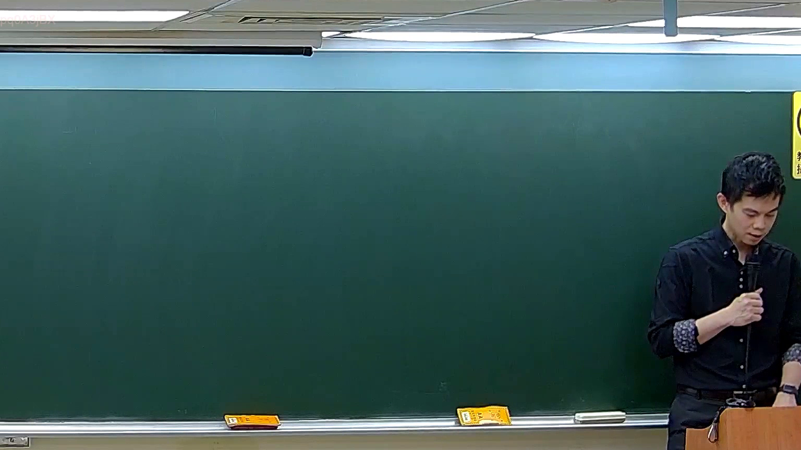

# 🎥 影音教材板書校對筆記
    - **來源影片**: [預約 5 2026-05-24 23-44-34-927](file:///H:///家事事件法115///ch5///預約 5 2026-05-24 23-44-34-927.mp4)
    - **課程分類**: `[家事事件法115`
    - **課堂章節**: `ch5]`
    - **影片時間戳記**: `00:21:30` (1290 秒)
    - **板書類型**: `影音板書`
    - **偵測時間**: 2026-08-04 03:43:29
    
    ## 🔍 擷取黑板板書對照圖
    
    
    ## 🧠 AI 智慧理解與知識庫演化註記
    ：
經仔細「看」所提供的圖片，本分析助理並未偵測到任何板書文字、符號或關係。圖片中的黑板區域為空白狀態。
由於未偵測到任何板書內容，故無法進行以下任務：
1.  **板書高精度 OCR**：無可辨識的文字。
2.  **板書詳細解讀與法條對照**：由於板書內容不明，無法針對其代表的法律學理、爭點、案例邏輯或關係進行解讀，亦無法對照臺灣現行法律條文。
3.  **生成 Mermaid 邏輯圖**：因無可辨識的關係結構，無法生成對應的Mermaid.js關係圖代碼。

請確認所提供的圖片是否為預期中含有板書內容的擷取畫面。若能提供清晰的板書圖片，本助理將能依要求進行精確分析。
    
    ## 📊 可編輯之 Mermaid 關係流程圖
    ```mermaid
    ：
（由於圖片中未偵測到任何板書內容與關係結構，故無法生成Mermaid邏輯圖。）
    ```
    
    ## ✍️ 操作者手動校對修改區
    <!-- 您可以直接修改上方的文字或調整 Mermaid 區塊中的節點，Obsidian 會即時重新渲染 -->
    - [ ] 欄位結構與法律邏輯已校對無誤。
    - **校對筆記**: 
    