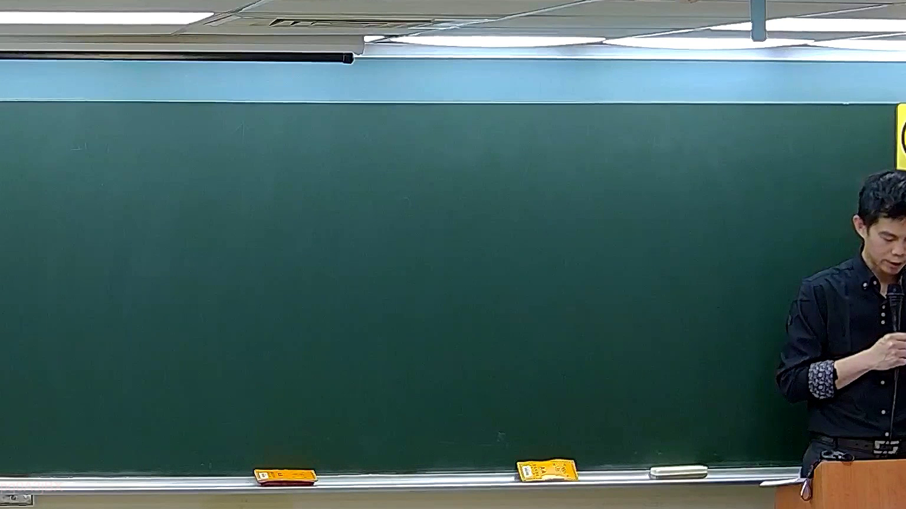

# 🎥 影音教材板書校對筆記
    - **來源影片**: [預約 5 2026-05-24 23-44-34-927](file:///H:///家事事件法115///ch5///預約 5 2026-05-24 23-44-34-927.mp4)
    - **課程分類**: `[家事事件法115`
    - **課堂章節**: `ch5]`
    - **影片時間戳記**: `00:32:30` (1950 秒)
    - **板書類型**: `影音板書`
    - **偵測時間**: 2026-08-04 03:44:40
    
    ## 🔍 擷取黑板板書對照圖
    
    
    ## 🧠 AI 智慧理解與知識庫演化註記
    ：
根據您提供的板書圖片進行高精度分析，圖片中老師書寫的板書內容為空白，未偵測到任何文字、符號或關係。

由於板書圖片呈現空白，未能辨識出任何法律學理、爭點、案例邏輯或關係。因此無法就特定內容進行詳細法律解讀，也無法對照或聯想臺灣現行法律條文（例如民法第184條關於侵權行為、或消滅時效等）。這可能表示老師正準備書寫，或剛擦除板書，亦或在該時間點的教學重點是以口頭講述為主，尚未同步呈現於板書上。
    
    ## 📊 可編輯之 Mermaid 關係流程圖
    ```mermaid
    ：
由於板書圖片為空白，沒有可供分析的結構或關係，故無法生成 Mermaid.js 關係圖代碼。
    ```
    
    ## ✍️ 操作者手動校對修改區
    <!-- 您可以直接修改上方的文字或調整 Mermaid 區塊中的節點，Obsidian 會即時重新渲染 -->
    - [ ] 欄位結構與法律邏輯已校對無誤。
    - **校對筆記**: 
    