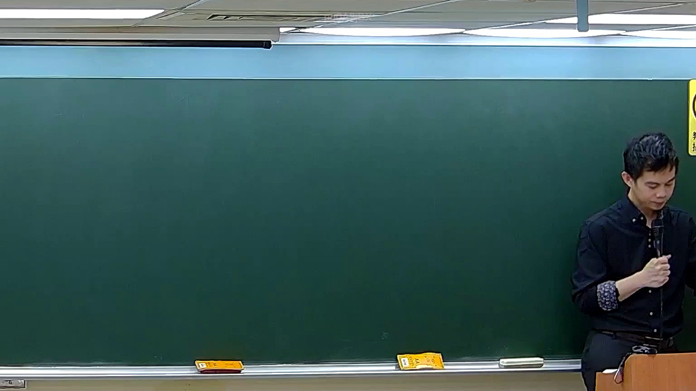

# 🎥 影音教材板書校對筆記
    - **來源影片**: [預約 5 2026-05-24 23-44-34-927](file:///H:///家事事件法115///ch5///預約 5 2026-05-24 23-44-34-927.mp4)
    - **課程分類**: `[家事事件法115`
    - **課堂章節**: `ch5]`
    - **影片時間戳記**: `00:46:30` (2790 秒)
    - **板書類型**: `影音板書`
    - **偵測時間**: 2026-08-04 03:45:25
    
    ## 🔍 擷取黑板板書對照圖
    
    
    ## 🧠 AI 智慧理解與知識庫演化註記
    ：
經仔細分析所提供的板書圖片，並未辨識出任何可閱讀的文字、符號或圖形。黑板畫面呈現為空白狀態，無 discernible 的板書內容。

雖然提示提及「偵測到老師書寫了板書並擷取了此圖片」，但從提供的影像來看，黑板上並無任何肉眼可辨識的書寫痕跡。因此，無法依據板書內容進行高精度 OCR、詳細解讀其所代表的法律學理、爭點、案例邏輯或關係，也無法對照臺灣現行法律條文（如民法第184條、侵權行為、消滅時效等）進行進一步的說明或註記。

若有後續包含板書內容的圖片，則可再進行相關分析。
    
    ## 📊 可編輯之 Mermaid 關係流程圖
    ```mermaid
    ：
graph TD
    A["黑板內容為空"] --> B["無法辨識任何關係結構"]
    B --> C["因此無法生成 Mermaid 邏輯圖"]
    ```
    
    ## ✍️ 操作者手動校對修改區
    <!-- 您可以直接修改上方的文字或調整 Mermaid 區塊中的節點，Obsidian 會即時重新渲染 -->
    - [ ] 欄位結構與法律邏輯已校對無誤。
    - **校對筆記**: 
    