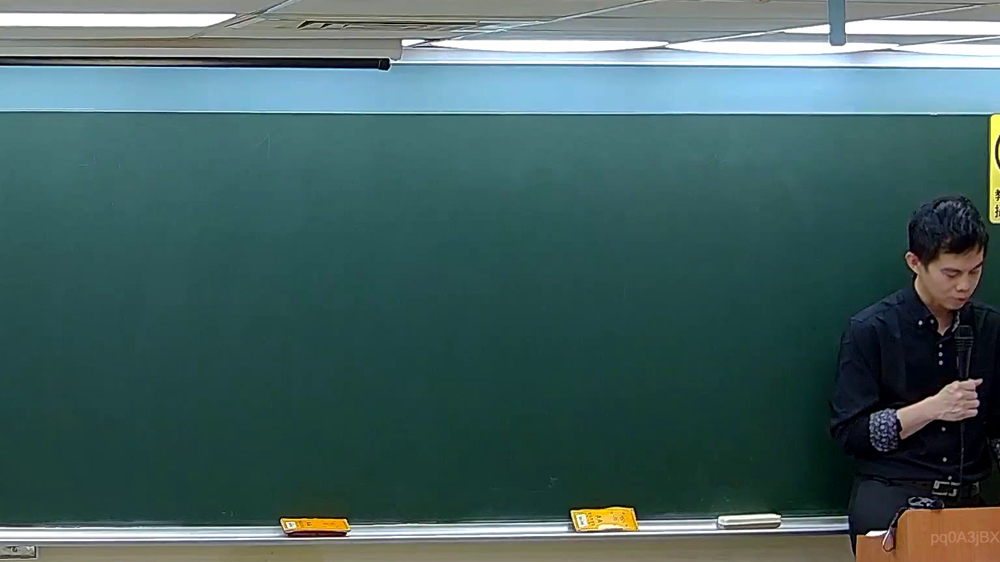

# 🎥 影音教材板書校對筆記
    - **來源影片**: [預約 5 2026-05-24 23-44-34-927](file:///H:///家事事件法115///ch5///預約 5 2026-05-24 23-44-34-927.mp4)
    - **課程分類**: `[家事事件法115`
    - **課堂章節**: `ch5]`
    - **影片時間戳記**: `00:48:15` (2895 秒)
    - **板書類型**: `影音板書`
    - **偵測時間**: 2026-08-04 03:45:49
    
    ## 🔍 擷取黑板板書對照圖
    
    
    ## 🧠 AI 智慧理解與知識庫演化註記
    ：
**板書高精度 OCR**: 經仔細辨識，圖片中並未偵測到任何清晰可辨識的板書文字、符號或關係。雖然在部分邊緣區域有極其微弱的擦拭痕跡，但無法構成任何有意義的書寫內容。
**板書詳細解讀與法條對照**: 由於圖片中未偵測到任何清晰的板書內容，故無法依據板書進行其所代表的法律學理、爭點、案例邏輯或關係的詳細解讀。因此，也無法對照或聯想臺灣現行法律條文（如民法第184條、侵權行為、消滅時效等）並寫下理解與演化註記。
    
    ## 📊 可編輯之 Mermaid 關係流程圖
    ```mermaid
    ：
graph TD
A["板書無可辨識內容"]
    ```
    
    ## ✍️ 操作者手動校對修改區
    <!-- 您可以直接修改上方的文字或調整 Mermaid 區塊中的節點，Obsidian 會即時重新渲染 -->
    - [ ] 欄位結構與法律邏輯已校對無誤。
    - **校對筆記**: 
    