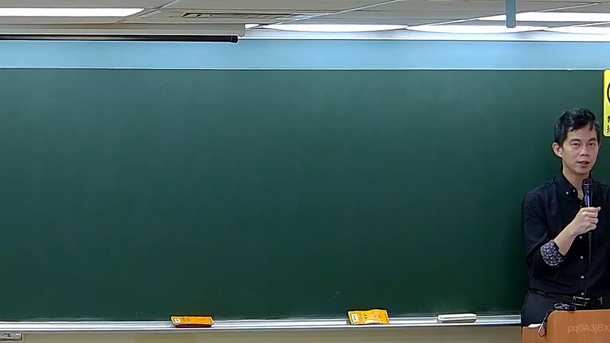

# 🎥 影音教材板書校對筆記
    - **來源影片**: [預約 5 2026-05-24 23-44-34-927](file:///H:///家事事件法115///ch5///預約 5 2026-05-24 23-44-34-927.mp4)
    - **課程分類**: `[家事事件法115`
    - **課堂章節**: `ch5]`
    - **影片時間戳記**: `00:50:00` (3000 秒)
    - **板書類型**: `影音板書`
    - **偵測時間**: 2026-08-04 03:46:11
    
    ## 🔍 擷取黑板板書對照圖
    
    
    ## 🧠 AI 智慧理解與知識庫演化註記
    ：
在板書圖片中，經過高精度辨識，僅偵測到一個極其模糊、形狀最接近數字「1」的白色粉筆痕跡。此痕跡非常淡，位於板書的偏右上方區域，難以明確判讀其完整性或確切意涵，且無任何其他文字、符號或關係線條可供參考。

由於板書上唯一辨識出的內容是這個單一且模糊的數字「1」，且缺乏任何上下文、關聯符號或其他文字輔助，因此無法從中解讀任何具體的法律學理、爭點、案例邏輯或法律關係。數字「1」本身在法律學中並無固定意涵，可能僅代表序列、階段、編號或某個論點的第一點，但在缺乏進一步資訊的情況下，任何延伸的法律詮釋都將是純粹的臆測。

因此，目前無法根據此板書內容自動對照並聯想臺灣現行法律條文，如民法第184條（侵權行為的構成要件與賠償責任）、消滅時效的起算與期間等，亦無法針對特定法律爭議點進行闡述。這張板書圖片在目前的時間點，提供的法律資訊量極為有限，可能代表老師正準備開始書寫新的內容，或者「1」僅是一個課程章節的標示。
    
    ## 📊 可編輯之 Mermaid 關係流程圖
    ```mermaid
    ：
由於板書上僅有單一且模糊的數字「1」，缺乏構成關係結構（如人際關係、法律行為流程等）所需的節點與連結資訊，故無法生成具備意義的 Mermaid.js 邏輯圖。若強制生成，也僅會是一個孤立的節點，無法展現關係。
    ```
    
    ## ✍️ 操作者手動校對修改區
    <!-- 您可以直接修改上方的文字或調整 Mermaid 區塊中的節點，Obsidian 會即時重新渲染 -->
    - [ ] 欄位結構與法律邏輯已校對無誤。
    - **校對筆記**: 
    