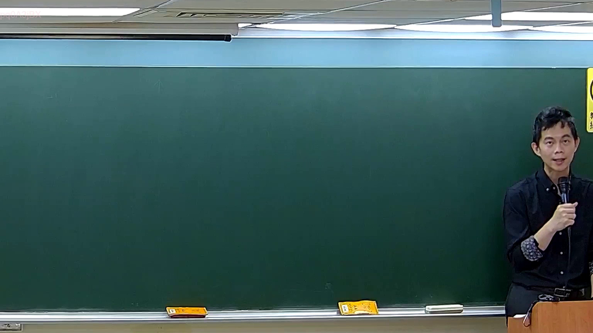

# 🎥 影音教材板書校對筆記
    - **來源影片**: [預約 5 2026-05-24 23-44-34-927](file:///H:///家事事件法115///ch5///預約 5 2026-05-24 23-44-34-927.mp4)
    - **課程分類**: `[家事事件法115`
    - **課堂章節**: `ch5]`
    - **影片時間戳記**: `00:51:00` (3060 秒)
    - **板書類型**: `影音板書`
    - **偵測時間**: 2026-08-04 03:46:23
    
    ## 🔍 擷取黑板板書對照圖
    
    
    ## 🧠 AI 智慧理解與知識庫演化註記
    ：
根據所提供的板書圖片，影像分析結果顯示板書上並無任何可辨識的文字、符號或繪製的關係圖。因此，無法進行板書高精度 OCR、詳細解讀其所代表的法律學理、爭點、案例邏輯或關係，也無法對照或聯想任何臺灣現行法律條文。目前的板書為空白狀態。
    
    ## 📊 可編輯之 Mermaid 關係流程圖
    ```mermaid
    ：
graph TD
    A["板書空白，無內容可分析"]
    ```
    
    ## ✍️ 操作者手動校對修改區
    <!-- 您可以直接修改上方的文字或調整 Mermaid 區塊中的節點，Obsidian 會即時重新渲染 -->
    - [ ] 欄位結構與法律邏輯已校對無誤。
    - **校對筆記**: 
    