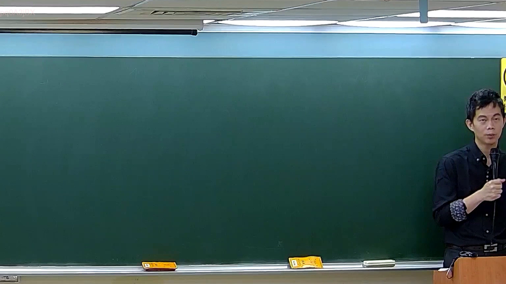

# 🎥 影音教材板書校對筆記
    - **來源影片**: [預約 5 2026-05-24 23-44-34-927](file:///H:///家事事件法115///ch5///預約 5 2026-05-24 23-44-34-927.mp4)
    - **課程分類**: `[家事事件法115`
    - **課堂章節**: `ch5]`
    - **影片時間戳記**: `00:52:45` (3165 秒)
    - **板書類型**: `影音板書`
    - **偵測時間**: 2026-08-04 03:46:37
    
    ## 🔍 擷取黑板板書對照圖
    
    
    ## 🧠 AI 智慧理解與知識庫演化註記
    ：
經高精度分析此板書圖片，並未偵測到老師在黑板上有任何文字、符號或圖形書寫。因此，無法依據板書內容進行法律學理、爭點、案例邏輯或關係的解讀，亦無法自動對照並聯想臺灣現行法律條文。圖片中的黑板呈現為空白狀態。
    
    ## 📊 可編輯之 Mermaid 關係流程圖
    ```mermaid
    ：
由於板書圖片上未偵測到任何文字、符號或結構關係，故無法生成對應的 Mermaid.js 邏輯圖代碼。
    ```
    
    ## ✍️ 操作者手動校對修改區
    <!-- 您可以直接修改上方的文字或調整 Mermaid 區塊中的節點，Obsidian 會即時重新渲染 -->
    - [ ] 欄位結構與法律邏輯已校對無誤。
    - **校對筆記**: 
    