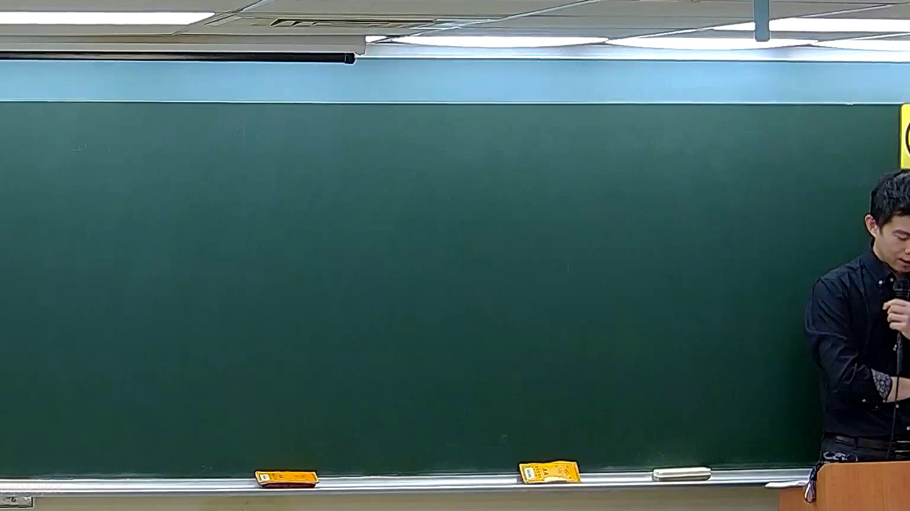

# 🎥 影音教材板書校對筆記
    - **來源影片**: [預約 5 2026-05-24 23-44-34-927](file:///H:///家事事件法115///ch5///預約 5 2026-05-24 23-44-34-927.mp4)
    - **課程分類**: `[家事事件法115`
    - **課堂章節**: `ch5]`
    - **影片時間戳記**: `00:56:15` (3375 秒)
    - **板書類型**: `影音板書`
    - **偵測時間**: 2026-08-04 03:46:59
    
    ## 🔍 擷取黑板板書對照圖
    
    
    ## 🧠 AI 智慧理解與知識庫演化註記
    ：
經仔細分析所提供的圖片，於時間點 56分15秒的板書圖片中，並未偵測到任何文字、符號或圖形。板書畫面呈現為空白。因此，無法進行板書的高精度 OCR、詳細解讀與法條對照，以及 Mermaid 邏輯圖的生成。
    
    ## 📊 可編輯之 Mermaid 關係流程圖
    ```mermaid
    ：
graph TD
    A["無偵測到板書內容"]
    ```
    
    ## ✍️ 操作者手動校對修改區
    <!-- 您可以直接修改上方的文字或調整 Mermaid 區塊中的節點，Obsidian 會即時重新渲染 -->
    - [ ] 欄位結構與法律邏輯已校對無誤。
    - **校對筆記**: 
    