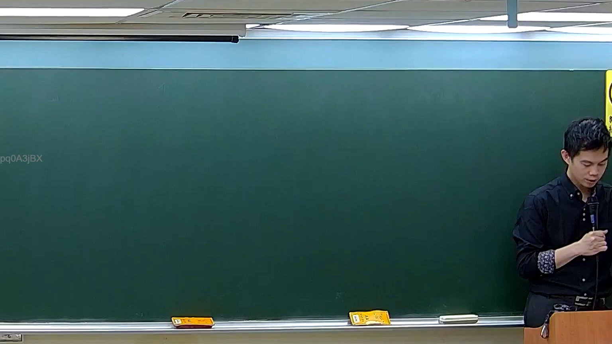

# 🎥 影音教材板書校對筆記
    - **來源影片**: [預約 5 2026-05-24 23-44-34-927](file:///H:///家事事件法115///ch5///預約 5 2026-05-24 23-44-34-927.mp4)
    - **課程分類**: `[家事事件法115`
    - **課堂章節**: `ch5]`
    - **影片時間戳記**: `01:00:30` (3630 秒)
    - **板書類型**: `影音板書`
    - **偵測時間**: 2026-08-04 03:47:28
    
    ## 🔍 擷取黑板板書對照圖
    
    
    ## 🧠 AI 智慧理解與知識庫演化註記
    ：
1.  **板書高精度 OCR**：
    *   經仔細檢視所提供的板書圖片，並未偵測到老師在板書上書寫任何文字、符號或繪製任何圖形。板書在圖片中顯示為完全空白狀態。

2.  **板書詳細解讀與法條對照**：
    *   由於板書上無任何實際書寫內容可供辨識，因此無法針對其可能代表的法律學理、爭點、案例邏輯或關係進行詳細解讀。
    *   在無板書內容作為基礎的情況下，亦無法自動對照並聯想臺灣現行法律條文（例如民法第184條、侵權行為、消滅時效等）或進行相關的理解與演化註記。
    
    ## 📊 可編輯之 Mermaid 關係流程圖
    ```mermaid
    ：
(由於板書上未偵測到任何文字、符號或關係結構可供分析，因此無法生成 Mermaid.js 關係圖代碼。)
    ```
    
    ## ✍️ 操作者手動校對修改區
    <!-- 您可以直接修改上方的文字或調整 Mermaid 區塊中的節點，Obsidian 會即時重新渲染 -->
    - [ ] 欄位結構與法律邏輯已校對無誤。
    - **校對筆記**: 
    