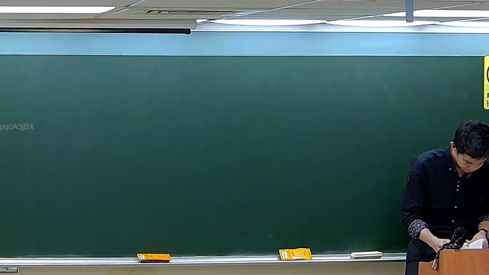

# 🎥 影音教材板書校對筆記
    - **來源影片**: [預約 5 New 2026-05-25 02-23-49-782](file:///H:///家事事件法115///ch5///預約 5 New 2026-05-25 02-23-49-782.mp4)
    - **課程分類**: `[家事事件法115`
    - **課堂章節**: `ch5]`
    - **影片時間戳記**: `00:20:00` (1200 秒)
    - **板書類型**: `影音板書`
    - **偵測時間**: 2026-08-04 03:15:44
    
    ## 🔍 擷取黑板板書對照圖
    
    
    ## 🧠 AI 智慧理解與知識庫演化註記
    ：
根據提供的板書圖片，本系統未能偵測到老師書寫的任何清晰可辨識的文字、符號或法律關係結構。黑板上雖有極其模糊的擦拭痕跡，但這些痕跡並未構成任何可供辨識或解讀的文字或圖形內容。因此，無法依據板書內容進行法律學理、爭點、案例邏輯的詳細解讀，也無法對應到特定的臺灣法律條文（如民法第184條、侵權行為、消滅時效等）並寫下理解與演化註記。本圖片所呈現的黑板在該時間點上，實質為空白狀態。
    
    ## 📊 可編輯之 Mermaid 關係流程圖
    ```mermaid
    ：
由於板書中未呈現任何文字或結構關係，故無法生成 Mermaid.js 關係圖代碼。
    ```
    
    ## ✍️ 操作者手動校對修改區
    <!-- 您可以直接修改上方的文字或調整 Mermaid 區塊中的節點，Obsidian 會即時重新渲染 -->
    - [ ] 欄位結構與法律邏輯已校對無誤。
    - **校對筆記**: 
    