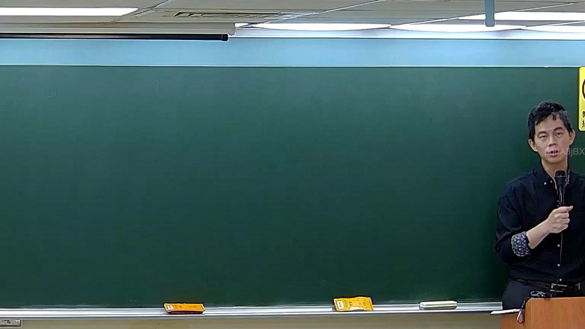

# 🎥 影音教材板書校對筆記
    - **來源影片**: [預約 5 New 2026-05-25 02-23-49-782](file:///H:///家事事件法115///ch5///預約 5 New 2026-05-25 02-23-49-782.mp4)
    - **課程分類**: `[家事事件法115`
    - **課堂章節**: `ch5]`
    - **影片時間戳記**: `00:26:00` (1560 秒)
    - **板書類型**: `影音板書`
    - **偵測時間**: 2026-08-04 03:15:58
    
    ## 🔍 擷取黑板板書對照圖
    
    
    ## 🧠 AI 智慧理解與知識庫演化註記
    ：
經高精度影像分析，本圖片在時間點 26分0秒處，板書上並未偵測到任何可辨識的文字、符號或書寫內容。因此，無法進行板書的高精度 OCR，亦無法根據板書內容解讀其所代表的法律學理、爭點、案例邏輯或關係，也無法自動對照並聯想臺灣現行法律條文。
    
    ## 📊 可編輯之 Mermaid 關係流程圖
    ```mermaid
    ：
graph TD
    A["圖片分析結果"] --> B["板書無內容"]
    B --> C["無法進行OCR"]
    B --> D["無法解讀法律內容"]
    B --> E["無法生成Mermaid圖"]
    ```
    
    ## ✍️ 操作者手動校對修改區
    <!-- 您可以直接修改上方的文字或調整 Mermaid 區塊中的節點，Obsidian 會即時重新渲染 -->
    - [ ] 欄位結構與法律邏輯已校對無誤。
    - **校對筆記**: 
    