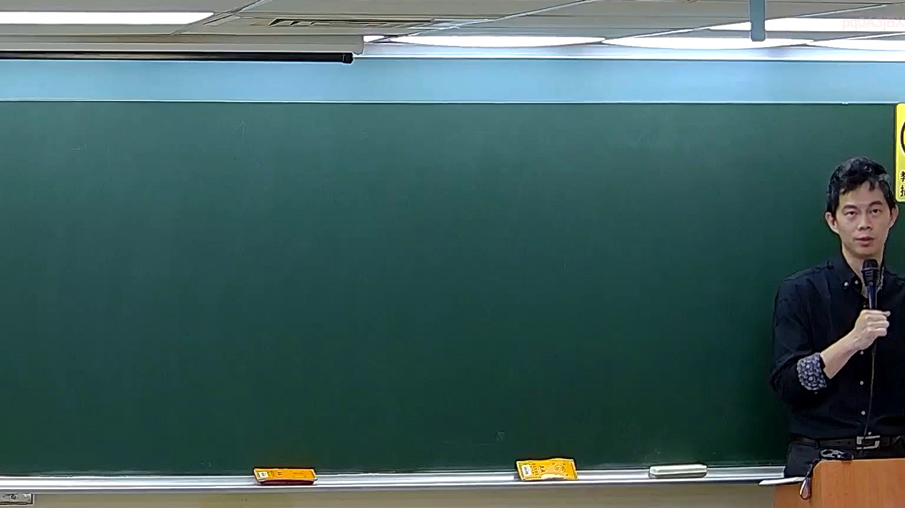

# 🎥 影音教材板書校對筆記
    - **來源影片**: [預約 5 New 2026-05-25 02-23-49-782](file:///H:///家事事件法115///ch5///預約 5 New 2026-05-25 02-23-49-782.mp4)
    - **課程分類**: `[家事事件法115`
    - **課堂章節**: `ch5]`
    - **影片時間戳記**: `00:29:00` (1740 秒)
    - **板書類型**: `影音板書`
    - **偵測時間**: 2026-08-04 03:16:40
    
    ## 🔍 擷取黑板板書對照圖
    
    
    ## 🧠 AI 智慧理解與知識庫演化註記
    ：
在提供的板書圖片中，經過高精度辨識，除了畫面右側邊緣可見一個黃色標示牌的局部文字（推測可能為「禁止攝影」等警示語，但非老師書寫之教學內容）以及左上方一個極為模糊且不明顯的白色短線（疑為殘餘粉筆痕或反光，無法辨識為任何有意義的文字或符號）外，板書主要區域並無任何可辨識的老師書寫文字、符號或圖形。

因此，由於板書內容實質空白，本助理無法根據圖片中未呈現的法律學理、爭點、案例邏輯或關係進行詳細解讀、法條對照、理解與演化註記。
    
    ## 📊 可編輯之 Mermaid 關係流程圖
    ```mermaid
    ：
由於圖片中未呈現任何板書內容，故無法根據板書來生成對應的Mermaid.js關係圖代碼。
    ```
    
    ## ✍️ 操作者手動校對修改區
    <!-- 您可以直接修改上方的文字或調整 Mermaid 區塊中的節點，Obsidian 會即時重新渲染 -->
    - [ ] 欄位結構與法律邏輯已校對無誤。
    - **校對筆記**: 
    