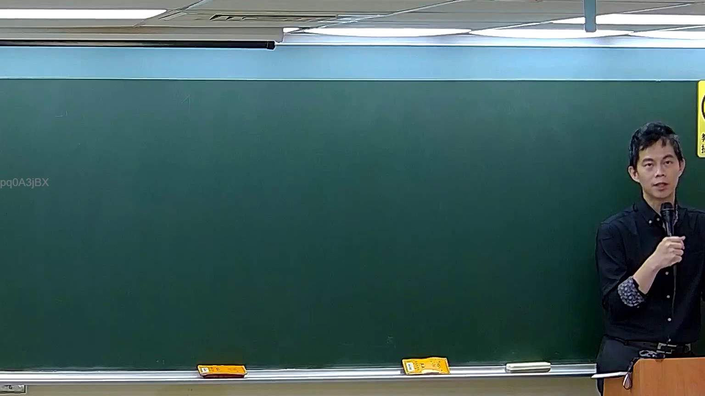

# 🎥 影音教材板書校對筆記
    - **來源影片**: [預約 5 New 2026-05-25 02-23-49-782](file:///H:///家事事件法115///ch5///預約 5 New 2026-05-25 02-23-49-782.mp4)
    - **課程分類**: `[家事事件法115`
    - **課堂章節**: `ch5]`
    - **影片時間戳記**: `00:33:15` (1995 秒)
    - **板書類型**: `影音板書`
    - **偵測時間**: 2026-08-04 03:17:17
    
    ## 🔍 擷取黑板板書對照圖
    
    
    ## 🧠 AI 智慧理解與知識庫演化註記
    ：
經仔細檢視圖片，並未偵測到老師書寫於黑板上的任何文字、符號或關係。圖片左側可見一串英數字元「pq0A3jBX」，此應為影像系統之浮水印或編號，並非老師書寫之板書內容。

雖然圖片中無可辨識之板書內容，但根據提示提及的「民法第184條、侵權行為、消滅時效」等關鍵字，推測此法律影音教材的討論核心可能圍繞於民事侵權行為及其相關法律效果。以下就這些概念進行闡述與法條對照：

1.  **侵權行為 (Tortious Act)**：
    *   **學理概念**：侵權行為是指行為人因故意或過失，不法侵害他人的權利或利益，導致他人受有損害，依法應負損害賠償責任的行為。它是民事責任的一種重要類型，目的在於填補受害人的損害，並遏止不法侵害行為。
    *   **法條對照 (臺灣現行法律)**：主要規定於《民法》債編第二章「侵權行為」中。其中最核心的條文是《民法》第184條，被稱為「一般侵權行為」條款。

2.  **民法第184條 (Civil Code Article 184)**：
    *   **條文內容與解讀**：
        *   **第一項**：「因故意或過失，不法侵害他人之權利者，負損害賠償責任。故意以背於善良風俗之方法，加損害於他人者亦同。」
            *   這是「一般侵權行為」的概括規定，確立了侵權行為的四大構成要件：(1) **行為**：包括積極行為或消極不作為。(2) **不法侵害**：侵害受法律保護的權利（如生命、身體、健康、名譽、自由、所有權等），通常需要判斷行為的不法性。(3) **故意或過失**：行為人主觀上須有可歸責性。(4) **損害與因果關係**：侵害行為與損害之間須有相當因果關係。
            *   「故意以背於善良風俗之方法，加損害於他人者亦同」是特別針對侵害「利益」而非「權利」的情形，若行為人故意且其行為違反公序良俗，即便未侵害特定法定權利，仍可能構成侵權。
        *   **第二項**：「違反保護他人之法律者，推定其有過失。」
            *   此項是「特別侵權行為」的一種，規定若行為人違反了目的在於保護他人利益的法規（例如交通法規），則推定其有過失，受害人無須舉證行為人的過失。
        *   **第三項**：「因故意或過失不法侵害他人基於父、母、子、女或配偶關係之身分法益而情節重大者，亦同。」
            *   這是2022年修正新增的條文，明確將侵害親屬關係身分法益（如親子、夫妻關係）納入侵權行為的保護範疇，尤其針對情節重大者。此修正強化了對家庭倫理和身分法益的保護。
    *   **學理爭點與演化註記**：民法第184條是侵權行為法的重要基石。學說上對於第一項「權利」與「利益」的區分、不法性判斷、過失與因果關係的認定，以及第二項「保護他人之法律」的範圍，都有許多討論與實務見解。第三項的增訂，顯示台灣法律對於非財產上損害的保護範圍逐漸擴大，反映社會對於身分法益重視程度的提升。

3.  **消滅時效 (Statute of Limitations)**：
    *   **學理概念**：消滅時效是指一定期間內不行使權利，導致該權利因時間經過而喪失請求權效力，債務人可拒絕給付的制度。其目的在於維持社會秩序與法律關係的安定，避免權利人長期不行使權利造成法律關係的不確定性。
    *   **法條對照 (臺灣現行法律)**：
        *   《民法》第197條針對侵權行為的損害賠償請求權設有特殊的消滅時效規定。
        *   **第一項**：「因侵權行為所生之損害賠償請求權，自請求權人知有損害及賠償義務人時起，二年間不行使而消滅；自有侵權行為時起，逾十年者亦同。」
            *   此條明確規定了兩種消滅時效期間：
                1.  **短期時效**：自受害人「知悉」損害及賠償義務人時起算，為2年。這是主觀上的起算點。
                2.  **長期時效**：自「侵權行為發生時」起算，為10年。這是客觀上的起算點，即便受害人不知情，超過10年請求權也會消滅。
        *   **第二項**：「前項時效，不因侵權行為人死亡而受影響。但請求權人對於侵權行為人之繼承人，自其知悉起，仍適用前項規定。」
    *   **學理爭點與演化註記**：消滅時效的計算在實務上常是爭議焦點，尤其是在損害或加害人不易即時知悉的情況（如公害、醫療糾紛）。「知有損害」的認定標準，以及長期時效對受害人權益的限制，都是法律學者與實務界不斷探討的議題。消滅時效制度在平衡權利人與義務人利益、維護法律關係安定方面扮演重要角色。
    
    ## 📊 可編輯之 Mermaid 關係流程圖
    ```mermaid
    ：
graph TD
    A["法律影音教材"] --> B["課程主題：民事侵權行為"]
    B --> C["侵權行為構成要件"]
    C --> C1["行為：故意或過失"]
    C --> C2["不法侵害：權利或利益"]
    C --> C3["損害與因果關係"]

    B --> D["相關法律條文"]
    D --> D1["民法第184條 (一般侵權行為)"]
    D1 --> D1a["第1項：概括規定、背於善良風俗"]
    D1 --> D1b["第2項：違反保護他人法律 (推定過失)"]
    D1 --> D1c["第3項：侵害身分法益 (新增)"]

    D --> D2["民法第197條 (侵權行為消滅時效)"]
    D2 --> D2a["短期時效：知悉後2年"]
    D2 --> D2b["長期時效：行為後10年"]

    C1 --> E["責任歸屬"]
    C2 --> E
    C3 --> E
    E --> F["損害賠償請求權"]
    F --> D2
    ```
    
    ## ✍️ 操作者手動校對修改區
    <!-- 您可以直接修改上方的文字或調整 Mermaid 區塊中的節點，Obsidian 會即時重新渲染 -->
    - [ ] 欄位結構與法律邏輯已校對無誤。
    - **校對筆記**: 
    