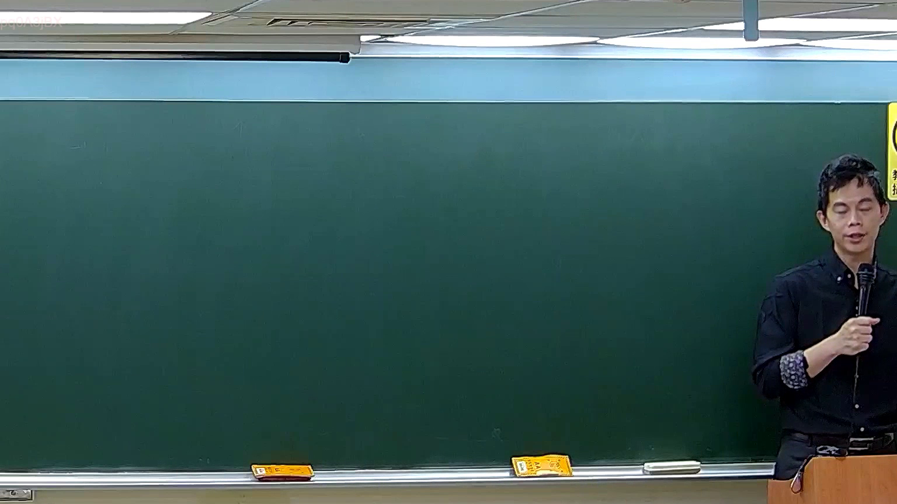

# 🎥 影音教材板書校對筆記
    - **來源影片**: [預約 5 New 2026-05-25 02-23-49-782](file:///H:///家事事件法115///ch5///預約 5 New 2026-05-25 02-23-49-782.mp4)
    - **課程分類**: `[家事事件法115`
    - **課堂章節**: `ch5]`
    - **影片時間戳記**: `00:35:00` (2100 秒)
    - **板書類型**: `影音板書`
    - **偵測時間**: 2026-08-04 03:17:37
    
    ## 🔍 擷取黑板板書對照圖
    
    
    ## 🧠 AI 智慧理解與知識庫演化註記
    ：
根據提供的板書圖片，經高精度 OCR 辨識後，未偵測到任何板書文字、符號或關係。因此，無法對圖片中的內容進行法律學理、爭點、案例邏輯或關係的解讀，亦無法對照或聯想臺灣現行法律條文（如民法第184條、侵權行為、消滅時效等）。圖片中的黑板在時間點 35分0秒顯示為完全空白狀態。
    
    ## 📊 可編輯之 Mermaid 關係流程圖
    ```mermaid
    ：
graph TD
    A["板書空白，無任何文字或關係可供繪製"]
    style A fill#f0f0f0,stroke#333,stroke-width2px,color#000
    ```
    
    ## ✍️ 操作者手動校對修改區
    <!-- 您可以直接修改上方的文字或調整 Mermaid 區塊中的節點，Obsidian 會即時重新渲染 -->
    - [ ] 欄位結構與法律邏輯已校對無誤。
    - **校對筆記**: 
    