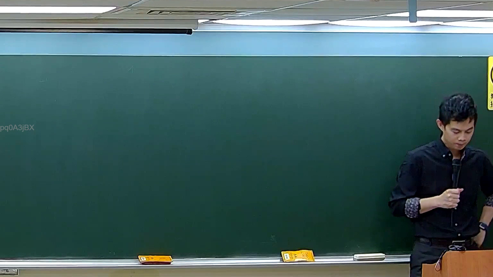

# 🎥 影音教材板書校對筆記
    - **來源影片**: [預約 5 New 2026-05-25 02-23-49-782](file:///H:///家事事件法115///ch5///預約 5 New 2026-05-25 02-23-49-782.mp4)
    - **課程分類**: `[家事事件法115`
    - **課堂章節**: `ch5]`
    - **影片時間戳記**: `00:36:45` (2205 秒)
    - **板書類型**: `影音板書`
    - **偵測時間**: 2026-08-04 03:17:53
    
    ## 🔍 擷取黑板板書對照圖
    
    
    ## 🧠 AI 智慧理解與知識庫演化註記
    ：
1.  **板書高精度 OCR 辨識結果：**
    經仔細檢視圖片，板書上並未偵測到老師書寫的任何法律文字、符號或圖形。僅在左上角邊緣處，可見極其模糊且非板書內容的文字浮水印「pq0A3jBX」，此應為影片系統的識別碼或播放資訊，與老師的教學內容無關。
2.  **板書詳細解讀與法條對照：**
    由於圖片中的板書沒有任何老師書寫的文字或圖示內容，因此無法針對板書進行法律學理、爭點、案例邏輯或關係的解讀。同時，也無法自動對照並聯想臺灣現行法律條文（例如民法第184條侵權行為、消滅時效等相關規定），亦無法寫下理解與演化註記。這可能表示在影片的此時間點，老師尚未開始書寫新的板書內容，或已將先前的內容擦除。
    
    ## 📊 可編輯之 Mermaid 關係流程圖
    ```mermaid
    ：
由於圖片中的板書上沒有任何文字、符號或關係結構可供辨識，因此無法生成 Mermaid.js 關係圖代碼。
    ```
    
    ## ✍️ 操作者手動校對修改區
    <!-- 您可以直接修改上方的文字或調整 Mermaid 區塊中的節點，Obsidian 會即時重新渲染 -->
    - [ ] 欄位結構與法律邏輯已校對無誤。
    - **校對筆記**: 
    