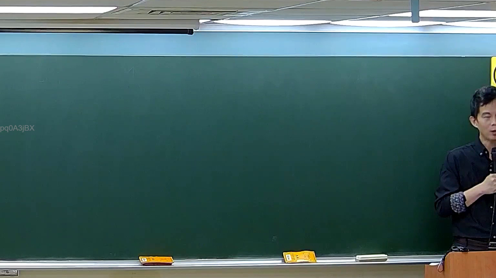

# 🎥 影音教材板書校對筆記
    - **來源影片**: [預約 5 New 2026-05-25 02-23-49-782](file:///H:///家事事件法115///ch5///預約 5 New 2026-05-25 02-23-49-782.mp4)
    - **課程分類**: `[家事事件法115`
    - **課堂章節**: `ch5]`
    - **影片時間戳記**: `00:43:00` (2580 秒)
    - **板書類型**: `影音板書`
    - **偵測時間**: 2026-08-04 03:18:13
    
    ## 🔍 擷取黑板板書對照圖
    
    
    ## 🧠 AI 智慧理解與知識庫演化註記
    ：
1.  **板書高精度 OCR 辨識結果**：
    本圖片中未偵測到老師書寫的任何板書內容。黑板表面為空白狀態，無可辨識的文字、符號或圖形。圖片左側邊緣可見一串英數字元 "pq0A3JBX"，但此應為影片系統的浮水印或編碼，而非老師書寫於黑板上的教學內容。
2.  **板書詳細解讀與法條對照**：
    由於圖片中未偵測到老師書寫的板書內容，因此無法針對其進行法律學理、爭點、案例邏輯或關係的解讀。同時，也無法依據板書內容對照並聯想臺灣現行法律條文，如民法第184條（侵權行為）、消滅時效等，進行理解與演化註記。
    
    ## 📊 可編輯之 Mermaid 關係流程圖
    ```mermaid
    ：
graph TD
    A["圖片中無老師書寫的板書內容"] --> B["無法執行板書OCR"]
    B --> C["無法進行法律學理與法條對照解讀"]
    C --> D["無法生成基於板書內容的關係圖"]
    ```
    
    ## ✍️ 操作者手動校對修改區
    <!-- 您可以直接修改上方的文字或調整 Mermaid 區塊中的節點，Obsidian 會即時重新渲染 -->
    - [ ] 欄位結構與法律邏輯已校對無誤。
    - **校對筆記**: 
    