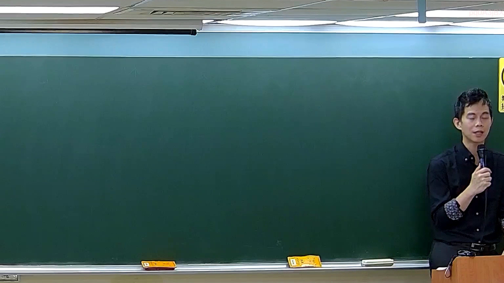

# 🎥 影音教材板書校對筆記
    - **來源影片**: [預約 5 New 2026-05-25 02-23-49-782](file:///H:///家事事件法115///ch5///預約 5 New 2026-05-25 02-23-49-782.mp4)
    - **課程分類**: `[家事事件法115`
    - **課堂章節**: `ch5]`
    - **影片時間戳記**: `00:48:30` (2910 秒)
    - **板書類型**: `影音板書`
    - **偵測時間**: 2026-08-04 03:18:29
    
    ## 🔍 擷取黑板板書對照圖
    
    
    ## 🧠 AI 智慧理解與知識庫演化註記
    ：
經仔細檢視所提供的圖片，本助理未能辨識出黑板上有任何文字、符號或關係結構。黑板顯示為空白狀態。因此，無法依據板書內容進行高精度 OCR 辨識，亦無法針對板書所代表的法律學理、爭點、案例邏輯進行詳細解讀，或自動對照並聯想臺灣現行法律條文。若有其他資訊或更清晰的板書圖片，本助理將能提供進一步的分析。
    
    ## 📊 可編輯之 Mermaid 關係流程圖
    ```mermaid
    ：
由於圖片中的黑板並未顯示任何文字或關係結構，故無法生成對應的 Mermaid.js 邏輯圖。
    ```
    
    ## ✍️ 操作者手動校對修改區
    <!-- 您可以直接修改上方的文字或調整 Mermaid 區塊中的節點，Obsidian 會即時重新渲染 -->
    - [ ] 欄位結構與法律邏輯已校對無誤。
    - **校對筆記**: 
    