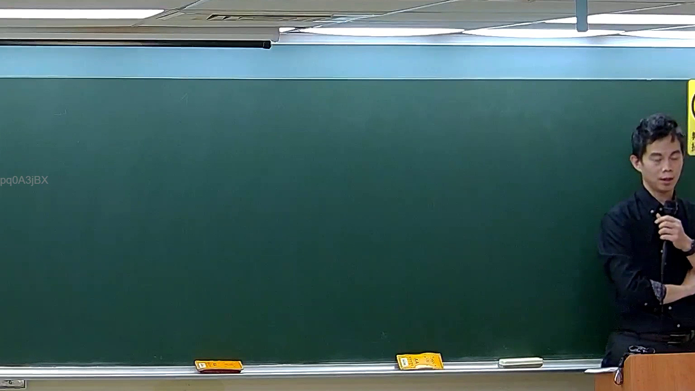

# 🎥 影音教材板書校對筆記
    - **來源影片**: [預約 5 New 2026-05-25 02-23-49-782](file:///H:///家事事件法115///ch5///預約 5 New 2026-05-25 02-23-49-782.mp4)
    - **課程分類**: `[家事事件法115`
    - **課堂章節**: `ch5]`
    - **影片時間戳記**: `00:55:30` (3330 秒)
    - **板書類型**: `影音板書`
    - **偵測時間**: 2026-08-04 03:19:02
    
    ## 🔍 擷取黑板板書對照圖
    
    
    ## 🧠 AI 智慧理解與知識庫演化註記
    ：
經高精度分析圖片，未偵測到老師於板書上書寫任何文字或符號。板書為空白狀態，僅左側可見「pq0A3jBX」字樣，此應為影像編碼或浮水印，並非板書內容。因此，無法依據板書內容進行法律學理、爭點或案例邏輯的解讀，亦無法對應相關法律條文。
    
    ## 📊 可編輯之 Mermaid 關係流程圖
    ```mermaid
    ：
graph TD
    A["無板書內容"]
    ```
    
    ## ✍️ 操作者手動校對修改區
    <!-- 您可以直接修改上方的文字或調整 Mermaid 區塊中的節點，Obsidian 會即時重新渲染 -->
    - [ ] 欄位結構與法律邏輯已校對無誤。
    - **校對筆記**: 
    