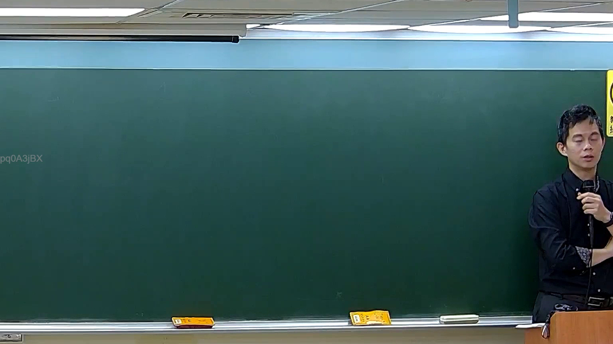

# 🎥 影音教材板書校對筆記
    - **來源影片**: [預約 5 New 2026-05-25 02-23-49-782](file:///H:///家事事件法115///ch5///預約 5 New 2026-05-25 02-23-49-782.mp4)
    - **課程分類**: `[家事事件法115`
    - **課堂章節**: `ch5]`
    - **影片時間戳記**: `00:57:00` (3420 秒)
    - **板書類型**: `影音板書`
    - **偵測時間**: 2026-08-04 03:19:17
    
    ## 🔍 擷取黑板板書對照圖
    
    
    ## 🧠 AI 智慧理解與知識庫演化註記
    ：
經仔細檢視所提供的板書圖片，在板書部分並未偵測到老師書寫的任何法律文字、符號或關係結構。圖片中左側可辨識出「pq0A3JBX」字樣，此應為影像本身的水印或識別碼，而非老師書寫的板書內容。

由於板書上沒有可供分析的法律學理、爭點、案例邏輯或關係，因此無法進行相關的法律解讀與臺灣現行法律條文對照。圖片呈現的黑板為空白狀態，沒有任何可連結至民法第184條、侵權行為、消滅時效等法律概念的書寫內容。
    
    ## 📊 可編輯之 Mermaid 關係流程圖
    ```mermaid
    ：
graph TD
    A["板書無可辨識之法律內容"]
    ```
    
    ## ✍️ 操作者手動校對修改區
    <!-- 您可以直接修改上方的文字或調整 Mermaid 區塊中的節點，Obsidian 會即時重新渲染 -->
    - [ ] 欄位結構與法律邏輯已校對無誤。
    - **校對筆記**: 
    