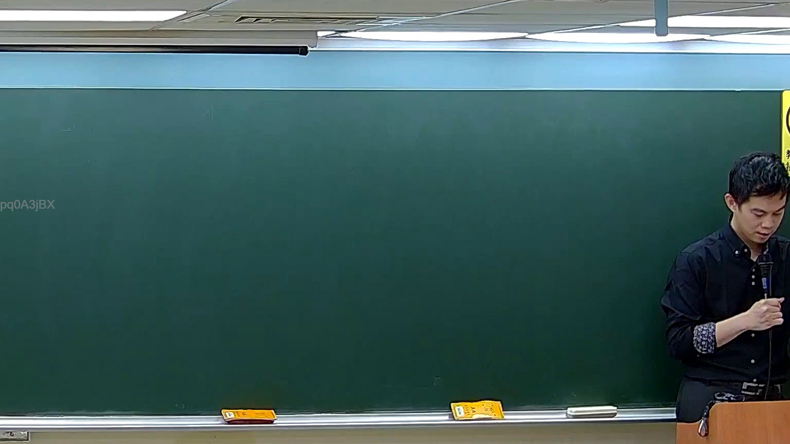

# 🎥 影音教材板書校對筆記
    - **來源影片**: [預約 5 New 2026-05-25 02-23-49-782](file:///H:///家事事件法115///ch5///預約 5 New 2026-05-25 02-23-49-782.mp4)
    - **課程分類**: `[家事事件法115`
    - **課堂章節**: `ch5]`
    - **影片時間戳記**: `01:00:00` (3600 秒)
    - **板書類型**: `影音板書`
    - **偵測時間**: 2026-08-04 03:19:39
    
    ## 🔍 擷取黑板板書對照圖
    
    
    ## 🧠 AI 智慧理解與知識庫演化註記
    ：
【板書高精度 OCR】：
經高精度辨識，圖片中老師板書區域並未偵測到任何由老師書寫的文字、符號或關係。黑板左側的「pq0A3jBX」應為影像浮水印或識別碼，非板書內容。

【板書詳細解讀與法條對照】：
由於板書區域中無任何老師書寫內容可供辨識，因此無法依板書內容進行法律學理、爭點、案例邏輯之詳細解讀，亦無法對照並聯想臺灣現行法律條文。
    
    ## 📊 可編輯之 Mermaid 關係流程圖
    ```mermaid
    ：
graph TD
    A["無板書內容"]
    A -- 故無結構可圖示 --> B["無法生成 Mermaid 邏輯圖"]
    ```
    
    ## ✍️ 操作者手動校對修改區
    <!-- 您可以直接修改上方的文字或調整 Mermaid 區塊中的節點，Obsidian 會即時重新渲染 -->
    - [ ] 欄位結構與法律邏輯已校對無誤。
    - **校對筆記**: 
    