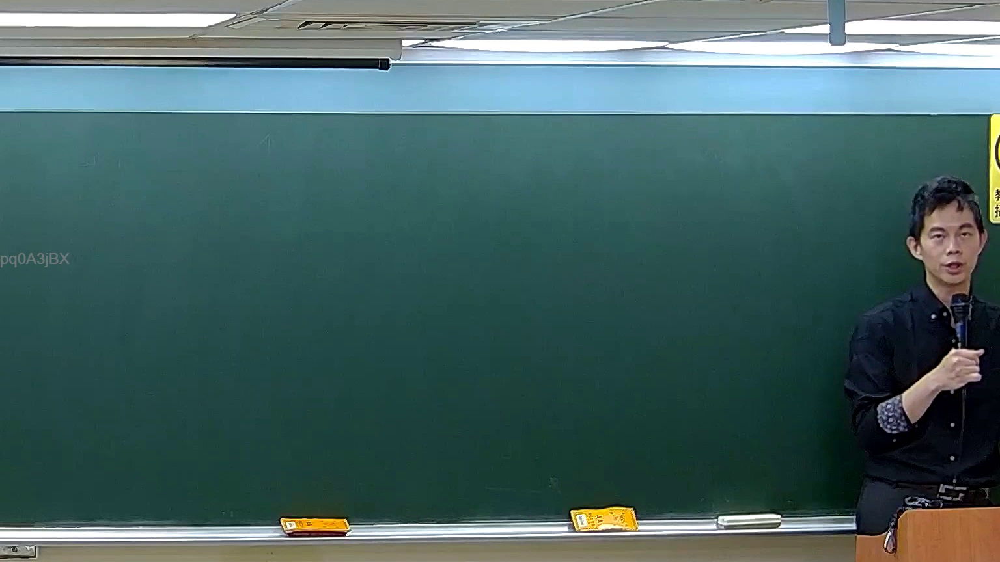

# 🎥 影音教材板書校對筆記
    - **來源影片**: [預約 5 New 2026-05-25 02-23-49-782](file:///H:///家事事件法115///ch5///預約 5 New 2026-05-25 02-23-49-782.mp4)
    - **課程分類**: `[家事事件法115`
    - **課堂章節**: `ch5]`
    - **影片時間戳記**: `01:00:30` (3630 秒)
    - **板書類型**: `影音板書`
    - **偵測時間**: 2026-08-04 03:19:51
    
    ## 🔍 擷取黑板板書對照圖
    
    
    ## 🧠 AI 智慧理解與知識庫演化註記
    ：
經仔細檢視圖片，在時間點 60分30秒處，板書區域為空白，並無任何老師書寫的文字、符號或關係圖。圖片左側可見一組英數字元 "pq0A3jBX"，此應為影片浮水印或內部編碼，非板書內容。由於板書無任何可供辨識的文字，因此無法就圖片本身提供法律學理、爭點、案例邏輯或法條對照的解讀。
    
    ## 📊 可編輯之 Mermaid 關係流程圖
    ```mermaid
    ：
graph TD
    A["板書空白"] --> B["無內容可供分析"]
    ```
    
    ## ✍️ 操作者手動校對修改區
    <!-- 您可以直接修改上方的文字或調整 Mermaid 區塊中的節點，Obsidian 會即時重新渲染 -->
    - [ ] 欄位結構與法律邏輯已校對無誤。
    - **校對筆記**: 
    