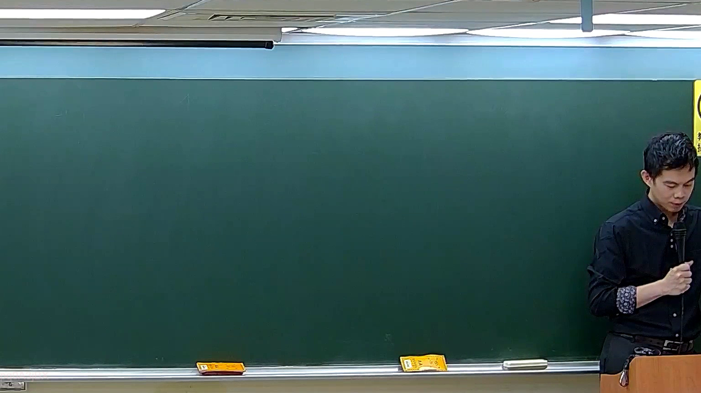

# 🎥 影音教材板書校對筆記
    - **來源影片**: [預約 5 New 2026-05-25 02-23-49-782](file:///H:///家事事件法115///ch5///預約 5 New 2026-05-25 02-23-49-782.mp4)
    - **課程分類**: `[家事事件法115`
    - **課堂章節**: `ch5]`
    - **影片時間戳記**: `01:08:45` (4125 秒)
    - **板書類型**: `影音板書`
    - **偵測時間**: 2026-08-04 03:11:33
    
    ## 🔍 擷取黑板板書對照圖
    
    
    ## 🧠 AI 智慧理解與知識庫演化註記
    ：
板書上僅在右上角偵測到一個極其模糊的數字：「1」。板書其餘部分均為空白，或筆跡過於模糊而無法辨識，因此無法進行高精度OCR。

由於板書上僅偵測到一個孤立的數字「1」，其上下文資訊完全缺失，故無法判斷其所代表的法律學理、爭點、案例邏輯或關係。在法律教學情境中，「1」通常作為列點或序號之用，例如「一、[討論主題]」或「1. [論點]」，用以標示某一系列內容的第一項。然而，在此情境下，僅憑單一數字無法推斷任何具體法律內容或其相關的學理。

因此，無法從單一數字「1」對照或聯想任何具體臺灣現行法律條文，如民法第184條、侵權行為、消滅時效等，亦無法提供相關的理解與演化註記。
    
    ## 📊 可編輯之 Mermaid 關係流程圖
    ```mermaid
    ：
由於板書上未能辨識出任何構成關係結構的文字或符號（除了孤立的「1」），故無法生成 Mermaid 邏輯圖。生成邏輯圖需要有明確的節點與連結關係，而本圖片中缺乏此類資訊。
    ```
    
    ## ✍️ 操作者手動校對修改區
    <!-- 您可以直接修改上方的文字或調整 Mermaid 區塊中的節點，Obsidian 會即時重新渲染 -->
    - [ ] 欄位結構與法律邏輯已校對無誤。
    - **校對筆記**: 
    