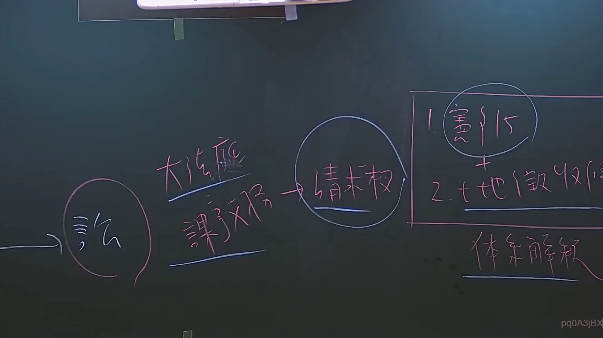

# 🎥 影音教材板書校對筆記
    - **來源影片**: [預約 6 2024-09-03 17-21-06-665](file:///J:/行政法A/ch34/預約 6 2024-09-03 17-21-06-665.mp4)
    - **課程分類**: `[行政法A`
    - **課堂章節**: `ch34]`
    - **影片時間戳記**: `00:17:00` (1020 秒)
    - **板書類型**: `關係圖/邏輯圖板書`
    - **偵測時間**: 2026-07-21 01:29:38
    
    ## 🔍 擷取黑板板書對照圖
    
    
    ## 🧠 AI 智慧理解與知識庫演化註記
    ：

您好，您的訊息中「擷取區域的 OCR 辨識字元如下：」之後**未附實際文字內容**，因此我無法針對具體板書進行語意整理與條文比對。

請您補充以下資訊後，我再為您完成完整分析：
1. **OCR 辨識出的實際字串**（例如：「民法第184條、故意不法侵害他人權利...」）
2. （若需要）老師在該時間點所講解的具體法律主題或爭議焦點

---

一旦您提供 OCR 文字，我將立即執行以下工作：
- 🔍 **語意整理**：將板書內容拆解為邏輯命題與法律概念
- ⚖️ **條文比對**：自動關聯民法第184條（侵權行為）、消滅時效、契約責任等相關規定，並標註「知識庫比對與理解演化註記」
- 📊 **Mermaid 圖表生成**：依板書類型輸出對應的 Mermaid.js 流程圖或邏輯樹

請貼上 OCR 文字即可繼續！
    
    ## 📊 可編輯之 Mermaid 關係流程圖
    ```mermaid
    graph TD
    A["影音板書"] --> B["尚無關聯關係"]
    ```
    
    ## ✍️ 操作者手動校對修改區
    <!-- 您可以直接修改上方的文字或調整 Mermaid 區塊中的節點，Obsidian 會即時重新渲染 -->
    - [ ] 欄位結構與法律邏輯已校對無誤。
    - **校對筆記**: 
    