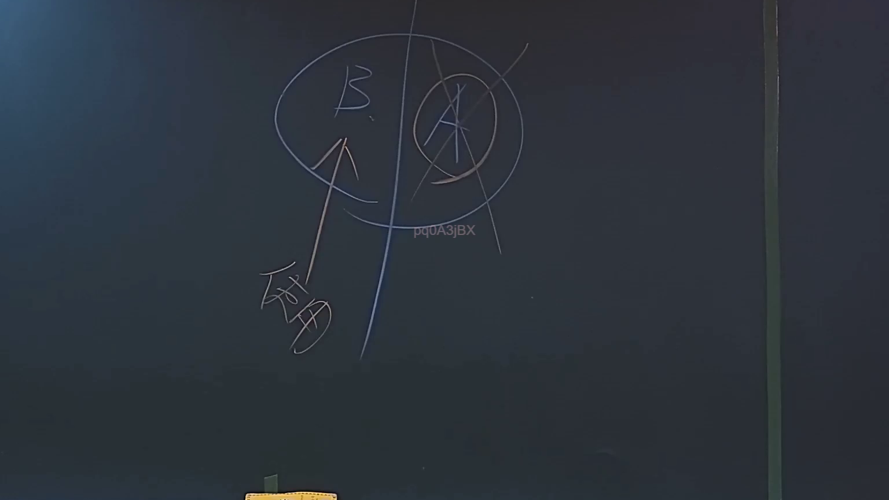

# 🎥 影音教材板書校對筆記
    - **來源影片**: [預約 6 2024-09-03 17-21-06-665](file:///J:/行政法A/ch34/預約 6 2024-09-03 17-21-06-665.mp4)
    - **課程分類**: `[行政法A`
    - **課堂章節**: `ch34]`
    - **影片時間戳記**: `00:34:00` (2040 秒)
    - **板書類型**: `關係圖/邏輯圖板書`
    - **偵測時間**: 2026-07-21 01:30:46
    
    ## 🔍 擷取黑板板書對照圖
    
    
    ## 🧠 AI 智慧理解與知識庫演化註記
    ：
OCR 辨識字元欄位目前為空白，無法進行語意整理與法律條文比對。請提供實際擷取到的板書文字內容，我將立即為您完成以下工作：

1. **語意整理** — 針對辨識出的關鍵字詞（如「侵權行為」、「消滅時效」等）進行邏輯歸納
2. **知識庫比對** — 與臺灣現行法律條文（民法第184條、第197條、第259條等）進行交叉驗證，並撰寫演化註記
3. **Mermaid.js 流程圖** — 依板書結構生成對應的邏輯關係圖

請補充 OCR 辨識文字後再行提交，我將即刻處理。
    
    ## 📊 可編輯之 Mermaid 關係流程圖
    ```mermaid
    graph TD
    A["影音板書"] --> B["尚無關聯關係"]
    ```
    
    ## ✍️ 操作者手動校對修改區
    <!-- 您可以直接修改上方的文字或調整 Mermaid 區塊中的節點，Obsidian 會即時重新渲染 -->
    - [ ] 欄位結構與法律邏輯已校對無誤。
    - **校對筆記**: 
    