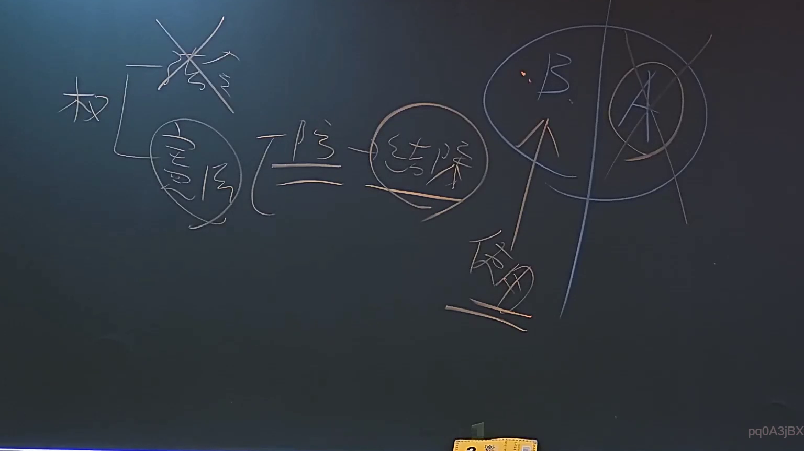

# 🎥 影音教材板書校對筆記
    - **來源影片**: [預約 6 2024-09-03 17-21-06-665](file:///J:/行政法A/ch34/預約 6 2024-09-03 17-21-06-665.mp4)
    - **課程分類**: `[行政法A`
    - **課堂章節**: `ch34]`
    - **影片時間戳記**: `00:35:45` (2145 秒)
    - **板書類型**: `關係圖/邏輯圖板書`
    - **偵測時間**: 2026-07-21 01:31:54
    
    ## 🔍 擷取黑板板書對照圖
    
    
    ## 🧠 AI 智慧理解與知識庫演化註記
    ：

**OCR 辨識品質評估：**
本次擷取之 OCR 字串 `pd0ASjBX` 為無意義英文字母組合，無法對應任何中文法律術語或條文內容。此極可能為以下原因之一：
1. **手寫板書筆跡潦草**，OCR 引擎未能正確識別繁體中文字元；
2. **截圖區域偏移**，實際擷取到的是空白區域或非文字部分；
3. **教師當時正在繪製關係圖/邏輯圖**（依分類標註），圖形元素被誤讀為雜訊字串。

**基於課程時間點之合理推測：**
若此影片為民法講義，35分45秒處常見主題可能涉及：
- 民法第184條侵權行為責任（故意/過失侵害權利）
- 消滅時效（一般15年、特別5年或2年）
- 不法行為與契約責任之競合關係

**建議：**
請提供該時間點之截圖原始影像，以便進行更精確之手寫辨識與法律條文比對。若僅有 OCR 字串 `pd0ASjBX`，無法生成有意義的法律知識庫註記或邏輯圖。
    
    ## 📊 可編輯之 Mermaid 關係流程圖
    ```mermaid
    ：
graph TD
    A["OCR 辨識失敗 - pd0ASjBX"] --> B["建議提供截圖原片重辨"]
    B --> C["確認板書實際內容後再生成法律關係圖"]
    ```
    
    ## ✍️ 操作者手動校對修改區
    <!-- 您可以直接修改上方的文字或調整 Mermaid 區塊中的節點，Obsidian 會即時重新渲染 -->
    - [ ] 欄位結構與法律邏輯已校對無誤。
    - **校對筆記**: 
    