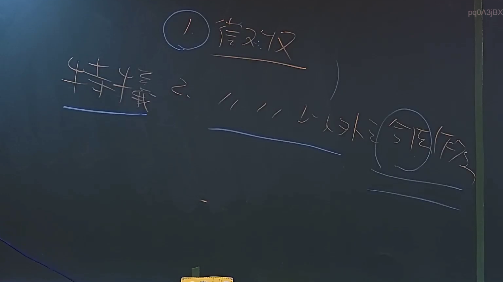

# 🎥 影音教材板書校對筆記
    - **來源影片**: [預約 6 2024-09-03 17-21-06-665](file:///J:/行政法A/ch34/預約 6 2024-09-03 17-21-06-665.mp4)
    - **課程分類**: `[行政法A`
    - **課堂章節**: `ch34]`
    - **影片時間戳記**: `00:45:30` (2730 秒)
    - **板書類型**: `關係圖/邏輯圖板書`
    - **偵測時間**: 2026-07-21 01:32:50
    
    ## 🔍 擷取黑板板書對照圖
    
    
    ## 🧠 AI 智慧理解與知識庫演化註記
    ：
您提供的訊息中，「擷取區域的 OCR 辨識字元」部分為空白，未實際貼上任何文字內容。我無法在沒有板書文字的情況下進行語意整理、法律條文比對或生成 Mermaid 流程圖。

請將老師黑板上的 OCR 辨識結果貼上來（例如：「民法第184條」「故意不法侵害他人權利」等），我會立即為您完成以下工作：
1. 語意整理與臺灣現行法律條文（如民法第184條、侵權行為責任、消滅時效等）的比對註記。
2. 根據板書內容生成對應的 Mermaid.js 流程圖代碼。

請補充 OCR 文字，我隨時待命！
    
    ## 📊 可編輯之 Mermaid 關係流程圖
    ```mermaid
    graph TD
    A["影音板書"] --> B["尚無關聯關係"]
    ```
    
    ## ✍️ 操作者手動校對修改區
    <!-- 您可以直接修改上方的文字或調整 Mermaid 區塊中的節點，Obsidian 會即時重新渲染 -->
    - [ ] 欄位結構與法律邏輯已校對無誤。
    - **校對筆記**: 
    